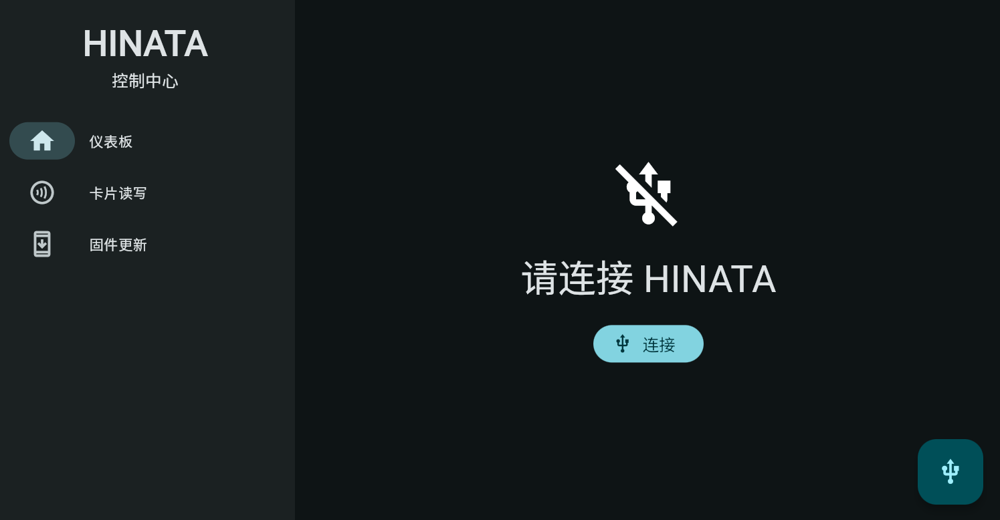
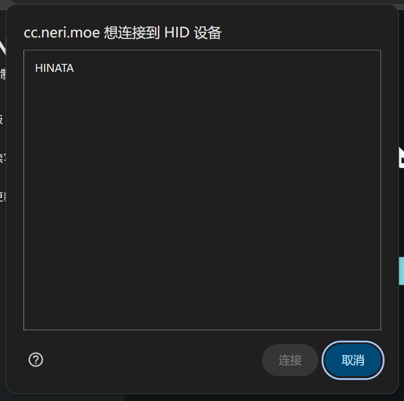
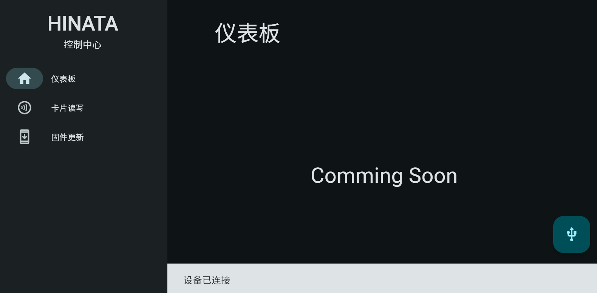
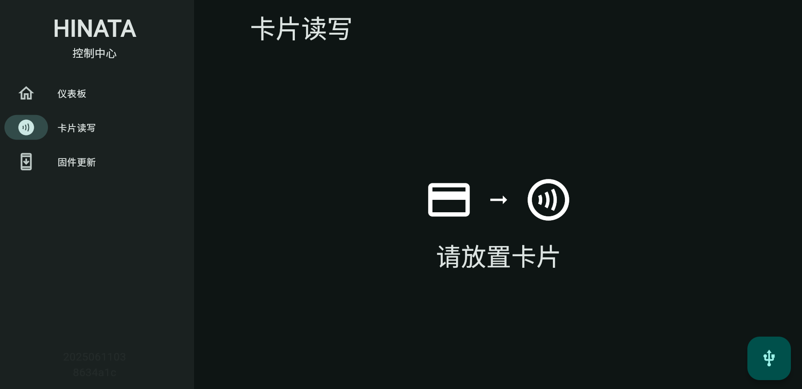
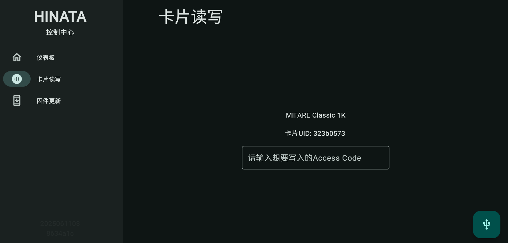

# HINATA Control Center  
Abbreviated as **HCC**. *Distinguish from [**HCP** (HINATA Control Panel)](../HCP/)*  

**Requires HINATA/HINATA Lite firmware ≥ 2025040400**  

## Introduction  
The HINATA Control Center manages HINATA device settings and card read/write operations (Coming Soon). Currently supports **firmware updates only**.  

No local installation needed—access via web browser at [cc.neri.moe](https://cc.neri.moe)!  
  

## Connecting  
1. Click the **Connect** button (or the icon at the bottom-right).  
2. Your browser will display a device selection prompt (Chrome example):  
     
3. **Select "HINATA"** → Click **Connect**.  
4. Successful connection displays:  
     

## Sidebar Options  

### Dashboard  
*Functionality coming soon.*  

### Card Read/Write  
1. Navigate to this section → Place card on the reader:  
     
2. After detection:  
   - For writable cards: Enter a **20-digit Access Code** → Press **Enter** to write.  
   - Unsupported cards show no input field:  
     

### Firmware Update  
***Windows users: Update via [HINATAUT](../Update/#updating-via-updater-tool-windows) instead.***  
  
1. Click **Install Update** on the card.  
2. Follow on-screen prompts.  