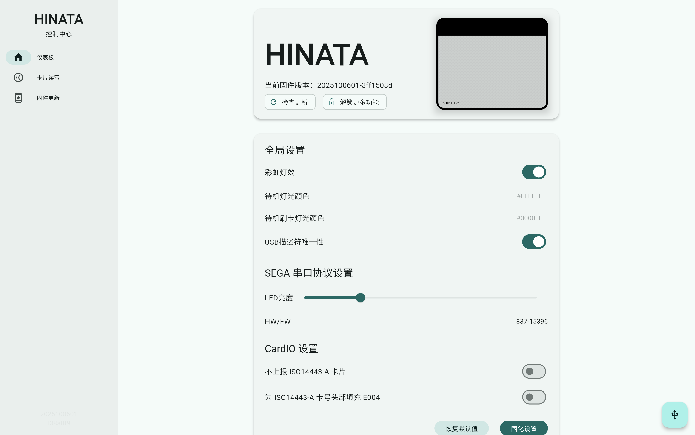

# HINATA Control Center

## Introduction
The HINATA Control Center is used to manage various settings of **HINATA / HINATA Lite** and provides functions such as card read/write.

No local download or installation required. Simply access via browser in **networked state**:  
[cc.neri.moe](https://cc.neri.moe)  
to use directly.

## Connecting the Reader
Click the **Connect** button on the page, or the quick button in the bottom-right corner. The browser will pop up a device selection window (example in Chrome):

Please select **HINATA** from the list and click **Connect**.

## Sidebar Function Overview

### Dashboard
The dashboard page displays the current reader's **firmware version** and provides current reader settings options.

### Card Read/Write
After entering the card read/write page, place the card to be operated on the reader:

After recognizing the card, the following interface will be displayed:

- When writing a card, enter the **20-digit Access Code** in the input box
- Press **Enter** after input to write the card number
- If **no input box for entering the card number appears**, the card **does not support writing**

### Firmware Update

::: warning
The current version **does not support direct firmware updates** through the control center on **Windows systems**.  
Please download the firmware file and update manually according to the documentation.
:::

::: tip
If you are using **macOS / Linux / ChromeOS** or other systems, you can complete the firmware update directly within the webpage.
:::

Click the **Install Update** button in the bottom-right corner of the card to start the firmware update process.
