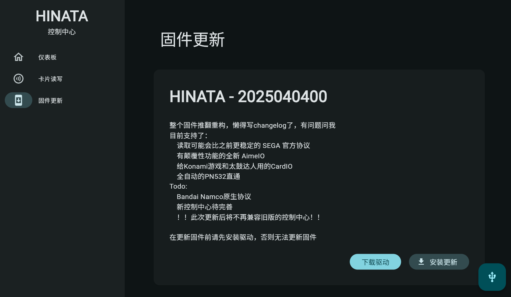

# HINATA Control Center

## Introduction
The HINATA Control Center is used to control the various settings of HINATA and for writing cards.

No local download is required, just connect to the internet and visit [cc.neri.moe](https://cc.neri.moe) to use it!

## Connection
Click the **Connect** button or the button in the lower right corner, and the browser will pop up the following window (taking Chrome as an example):

Please **click on HINATA** and then **click the Connect button**.

## Sidebar Options

### Dashboard
The dashboard displays the current firmware version of the card reader and allows you to adjust settings.

### Card Reading and Writing
After the following interface appears, please place the card to be read or written on the card reader.

After placing the card, the following interface will appear. To write a card, please enter the **20-digit Access Code** into the input box and **press Enter** to write the card number. If there is no dialog box for card number input, it means the card does not support writing.

### Firmware Update
**The current version does not support firmware updates through the Control Center on Windows. Please download the firmware and update it manually.**  
**If you are using MacOS, Linux, ChromeOS, or other systems, you can update directly on the webpage.**

Click the **Install Update** button in the lower right corner of the card to update the firmware.