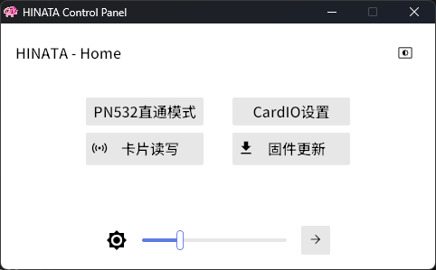
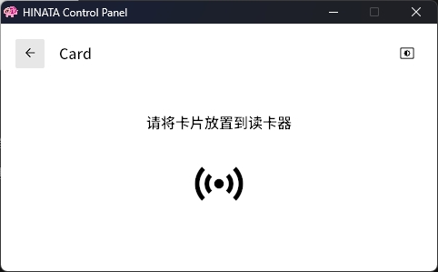

# HINATA Control Panel
Abbreviated as **HCP**. *Distinguish from [**HCC** (HINATA Control Center)](../HCC/)* 

**This feature is limited to the standard version.**

## Introduction
The HINATA Control Panel is used to manage various settings for HINATA and for writing cards. The adjusted settings are not stored in HINATA; they will not be saved when HINATA is powered off. However, the Control Panel will save the settings, and when HINATA reconnects to the Control Panel, it will automatically sync back to the last settings.

Future updates will include a restructured control panel and the ability for the card reader to persist settings.

[Click here to download the HINATA Control Panel](https://github.com/nerimoe/HINATA-release/releases/download/HINATA-2024090300/HINATA-Control-Panel-2024050400.7z)  

## Main Switches
1. **PN532 Direct Pass Mode:** This allows the serial port to be passed through as a PN532 device for use with third-party NFC tools (default is off).
2. **Theme Switch:** Toggle between dark and light themes in the upper right corner.
3. **Brightness Slider:** The slider at the bottom adjusts the brightness in SEGA serial mode (brightness can be adjusted in `segatools.ini` under AimeIO mode). The button next to it leads to the settings page for idle light.
4. **Firmware Update:** Firmware updates are not yet implemented in the control panel. The button currently has no function; please use the methods in this document to update.

## Card Reading and Writing

* This page is used to read card information and write [compatible cards](https://s.taobao.com/search?commend=all&ie=utf8&initiative_id=tbindexz_20170306&page=1&q=m1%E7%99%BD%E5%8D%A1&search_type=item&sourceId=tb.index) as Aime cards.
* When a [compatible card](https://s.taobao.com/search?commend=all&ie=utf8&initiative_id=tbindexz_20170306&page=1&q=m1%E7%99%BD%E5%8D%A1&search_type=item&sourceId=tb.index) (Mifare Classic 1k) is placed and the card is writable, a write dialog and button will automatically pop up. You can write a 20-digit `Access Code` for SEGA games or for CardIO with `Access Code` reading functionality enabled.
* The provided white card can also be written here.
* **Please do not open the card reading and writing page while in-game**, as this may cause communication issues with the game.

## CardIO Settings

1. **CardIO** is used for **KONAMI games** and **Taiko no Tatsujin**. If you only play SEGA games, you can ignore the following settings.
2. **UID Switch:** Enable/disable support for UID reading of M1 cards (default is on).
3. **Access Code Switch:** Enable/disable support for reading the 20-digit card number of old Aime cards or old Aime-compatible cards (default is off).

### Additional Notes on CardIO

Compatible games (KONAMI games and Taiko no Tatsujin) receive an 8-byte hexadecimal data packet, where the first character must be 0.

A standard `Mifare Classic 1K` (M1) card has a 4-byte UID.

* When UID reading is enabled, reading an M1 card will fill the first four bytes of the CardIO data with the M1 card's UID, modifying the first byte to 0, while the remaining bytes will be filled with 0.
    
    For example, if the card's UID is `11:45:14:19`, the data sent to the game will be `01:45:14:19:00:00:00:00`.
    
* When the Access Code switch is enabled, reading an old **Aime** card will convert the 20-digit Access Code into 8 bytes of hexadecimal data.
  For example, if a card's number is `1145 1419 1981 0114 5141`, upon swiping the card, the reader will convert it to `0e:eb:9d:16:a4:e8:46:35` before sending it to the game.
    
* Since old Aime cards are M1 cards, they have both an Access Code and a UID, so:
    * If the Access Code switch is off but the UID switch is on, the card will be treated as a regular M1 card, and the UID will be sent to the game.
    * If the Access Code switch is on but the UID switch is off, only old Aime cards will be accepted, and the Access Code will be converted to hexadecimal for the game.
    * If both switches are on, when swiping an old Aime card, the Access Code will be sent to the game. If a regular M1 card is detected, the UID will be sent instead.
    * If both switches are off, neither old Aime cards nor regular M1 cards will be accepted; only Felica cards will be accepted.
* **Felica** cards (e.g., **Amusement IC**, **Suica**, etc.) can be swiped at any time, regardless of these two switches.
* The **Oxygen panel** will filter card numbers when binding; card numbers **not starting with 01:2e** will typically be rejected for binding.