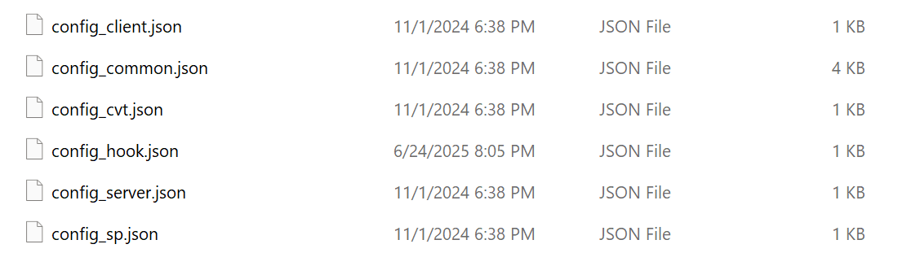
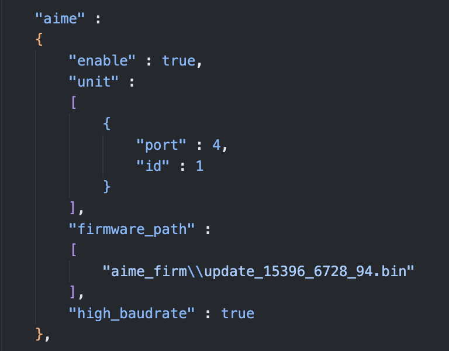

# Modifying Game Port Numbers  

**Skip this section if you do not need to switch between CHUNITHM and maimai/ONGEKI frequently or have no special requirements.**  

*This guide applies only to users connecting via the official serial protocol. If you modify configuration files as described below but later switch to **Keyboard Emulation (Enter Key)** or **AimeIO**, revert these changes to avoid functionality issues.*  

## Introduction  
| Game       | Default Port |  
| :--------- | :----------- |  
| maimai DX  | COM1         |  
| ONGEKI     | COM1         |  
| CHUNITHM   | COM4         |  

These are the default ports for the three major SEGA rhythm games, but they **are not fixed**. Users can modify the required port via configuration files.  

### Use Case  
Suppose you have one PC and one card reader but want to play multiple games. Since maimai and ONGEKI share the same default port, they work out-of-the-box. However, CHUNITHM uses a different port (COM4), requiring manual adjustments for seamless switching.  

Most SEGA games use `amdaemon`, which controls card reader settings. The port number can be modified in `amdaemon`’s configuration files.  

## File Modification  
### Configuration Files  
Typical `amdaemon` configuration files:  
  

- `config_client.json` / `config_server.json`: Network distribution settings (irrelevant here).  
- `config_hook.json`: Segatools overrides (ignore).  
- `config_cvt.json` / `config_sp.json`: **CHUNITHM-exclusive** files (vary by cabinet type).  
- `config_common.json`: Universal configuration for all games.  

**The port setting resides in:**  
- `config_common.json` (for maimai/ONGEKI)  
- `config_cvt.json` or `config_sp.json` (for CHUNITHM, depending on cabinet mode).  

### Editing Steps  
1. Open `config_common.json` (or `config_cvt/sp.json` for CHUNITHM).  
2. Locate the `aime` section:  
     
3. Change `"port": 4` to an **unused port number** (e.g., `7` → COM7).  

### "Unused Port" Definition  
Avoid ports reserved for other official hardware. Examples:  

| Game              | Occupied Ports & Usage                      |  
| :---------------- | :------------------------------------------ |  
| **maimai DX**     | COM2: VFD Screen COM3/COM4: Touchscreens COM21/COM23: LED |  
| **ONGEKI**        | COM2: VFD Screen COM3: LED       |  
| **CHUNITHM (SP)** | COM1: Ground Slider COM2: VFD Screen COM20/COM21: LED |  
| **CHUNITHM (CVT)**| COM1: Ground Slider COM2/COM3: LED |  

***Never*** assign the card reader to these ports.  

## Practical Example  
*Goal: Use one card reader for both CHUNITHM and maimai on a single PC.*  
1. Edit maimai’s `config_common.json` to change the port to COM7. 
2. Edit CHUNITHM’s `config_cvt.json` or `config_sp.json` to change the port to COM7. 
3. Open **Device Manager** → Set the card reader’s port to **COM7** → Replug the device.  

Now both games use COM7, eliminating the need to reconfigure ports when switching games.