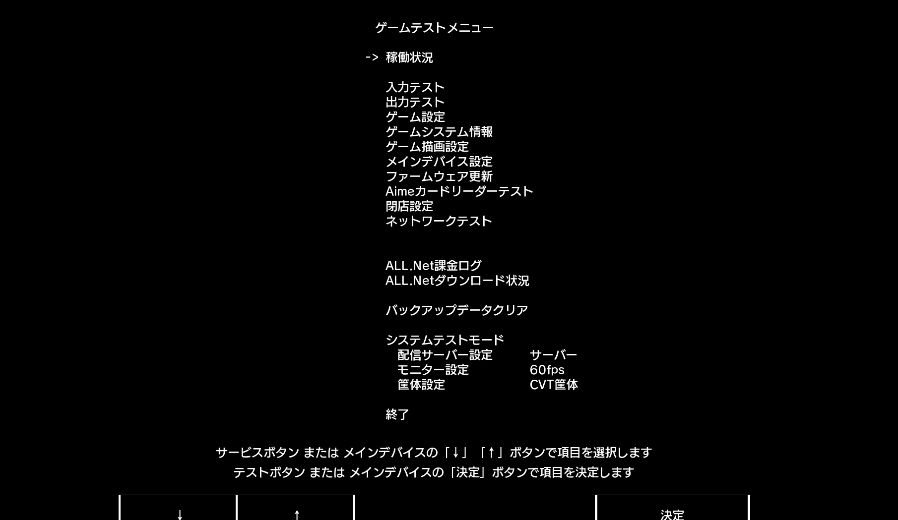

# In-game card reader test

1. Enter the *Test Mode (TEST)* of the corresponding game. 
2. Select `Aime Card Reader Test` using the specific operation method of each game. 
3. Inside, you can perform **card reading tests** and **LED tests**.  
After disabling the Aime hook in Segatools, if the top two lines of the hardware and software version numbers do not show anything in the game, it means the game has not successfully connected to the card reader.

## Other Pages
* [Connecting to the game via serial port](serial.md)
* [Connecting to the game via AimeIO](aimeio.md)
* [KONAMI Game Settings](../KONAMI/index.md)
