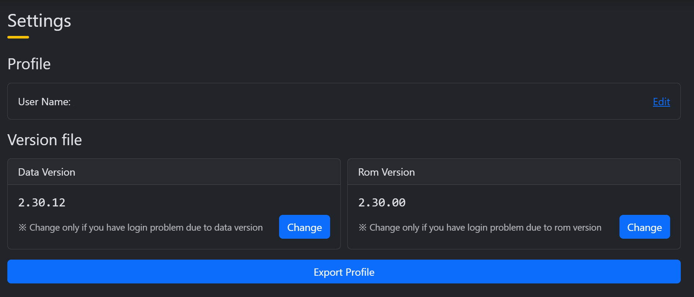
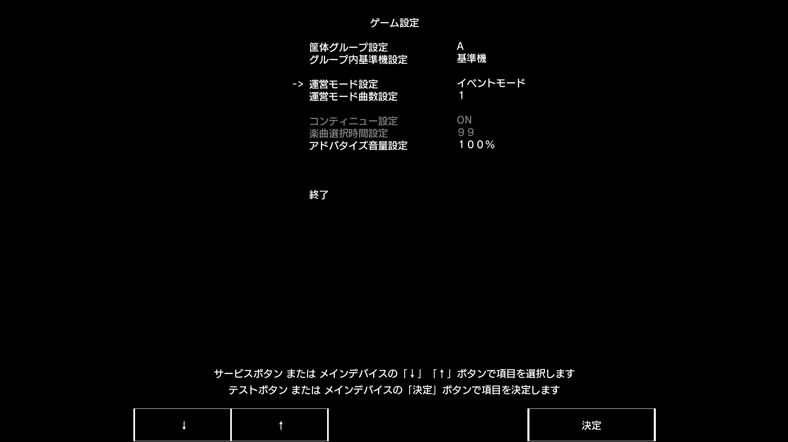
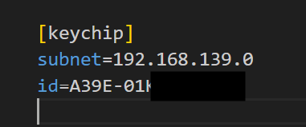
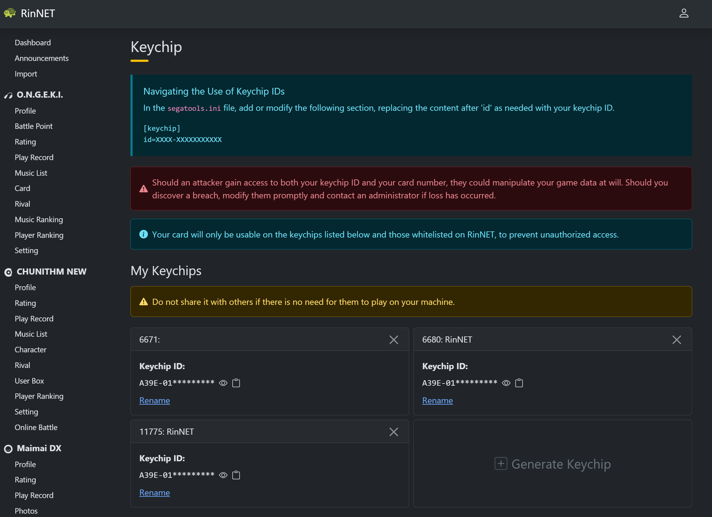

# Frequently Asked Questions (SEGA)
---

**Q: Why was my game able to connect to the network before using the card reader, but can't connect after using it?**  
**A:** After disabling the simulated card reader in Segatools, the game will directly disconnect from the network if it does not detect a card reader. So please check if the card reader's connection and configuration are correct.

---

**Q: I have confirmed that the card reader is connected (the lights are controlled normally), but I cannot swipe the card.**  
**A:** Is it attached to the surface of an ADX, or is there metal under the card reader? If so, please raise it with a non-metallic material or move it elsewhere.

---

**Q: The card number swiped from the official card in the game (starting with 0008) is different from the one printed on the back.**  
**A:** If you use the official protocol, the card number you get when swiping an `Amusement IC` card will depend on the server. If the AimeDB server is implemented correctly, it will work (Rin server, official AimeDB). The solution is to change the server, or use the **new AimeIO**.

---

**Q: What if the card reader has too few features / has bugs?**  
**A:** For feature suggestions or bugs, please directly raise them in the after-sales group or private message me. Software bugs will be fixed as soon as possible after verification.

---

**Q: What if I can't swipe my card?**  
**A:** Please pay attention to the game's prompt message:
1. **筐体のデータが古いバージョンです (The cabinet's data is an old version)**:  

    Please confirm if you have played a higher version of the game before. You can also check the server dashboard interface (e.g., Rin server):

    

    Please make sure the game version corresponds, or you can modify the version number to the corresponding game version or lower.

2. **このモードでは本バージョンのプレイデータが存在しない Aime は使用できません (Aime cards without play data for this version cannot be used in this mode)**:  

    Please confirm if you have enabled tournament mode. New accounts cannot be registered in tournament mode.  
    Taking SDHD (after CHUNITHM NEW) as an example:

    

    Please change **イベントモード (Event Mode)** here to **通常モード (Normal Mode)**.

3. **通信に失敗しました (Communication failed)**:  

    Please confirm that you are properly connected to the network and have correctly filled in the KeychipID:

    

    To obtain and use the KeychipID, please check the server dashboard interface yourself. Here is an example from the Rin server:  

    

    For other issues, please check **the card you are using and the connection method**:  

    Most compatible cards cannot be swiped when using the **official AimeDB**.  
    [See here if you can't swipe your card with the AimeIO connection method](aimeio.md#important-notes)

---