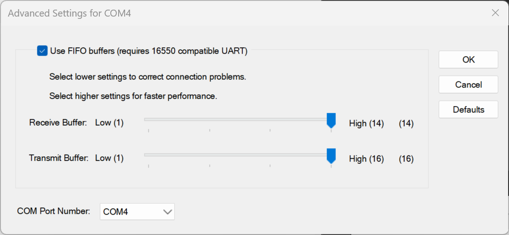

# Connecting to SEGA Games via Official Serial Protocol

## Important Notes
When using SEGA's official serial card reader protocol, you need to disable the reader hook in Segatools. If the game fails to connect to the reader after disabling the hook (for example, due to incorrect settings), the game will lose its internet connection. You will need to fix the issue and restart the game.

## Card Reader Port Configuration

| Game       | Port Number |
|------------|-------------|
| maimai DX  | COM1        |
| ONGEKI     | COM1        |
| CHUNITHM   | COM4        |

1. First, confirm the **port number** for the game you are playing and make a note of it. The above are the default port numbers for commonly used games. For other games using amdaemon, you can check in `config_common.json`.

2. 
   1. Open Windows `Device Manager`. By default, devices are listed by type.
   2. Ensure that the port number corresponding to the game’s connection to the reader is not occupied by other devices.
   3. **Unplug the card reader** and look for the `Ports` dropdown menu.

   

   4. If you do not see the `Ports` dropdown menu, you can proceed to the next step. If it is present, check whether any devices are occupying the target port.
   5. If a device is using the port, right-click on that device and select `Properties → Port Settings → Advanced...`.

   

   6. Change the `COM Port Number` to **another port number** (e.g., COM255).
3. **Plug in the card reader** and navigate to the following menu (**Devices by Container**).

   

4. Find **HINATA**.

   

5. Right-click on `USB Serial Device`, and select `Properties → Port Settings → Advanced...`.
6. Change the `COM Port Number` to the required port number for your game. Since the card reader uses *USB CDC* class for serial communication, there is usually no need to modify the baud rate settings.
7. After making the changes, you need to unplug and replug the card reader.

## Game Configuration
1. First, ensure that your game is **connected to the internet** and shows a **green globe icon** after entering the game. If not, you need to set up the game's internet connection, which is not covered in this document.
2. Open `segatools.ini` and modify it as follows:
   ```ini
   ; If there is no [aime] entry, please manually add this entry and its content
   [aime]
   enable=0
   ; Setting enable=0 disables Segatools' reader hook, allowing the use of the official serial IO. Please make sure to set this.

   ; If there is an [aimeio] entry (e.g., if using HINATA's AimeIO mode, or Mageki or Nageki)
   ; comment it out by adding ";" in front, or delete the entire section
   [aimeio]
   ;path=hinata.dll
   ; If the above entries exist, please make sure to delete them.
   ```
3. Since the card reader uses *USB CDC* class for serial communication, there is usually no need to modify the baud rate settings.
4. Start the game.

## Other Resources
* [Adjusting Light Brightness in Serial Mode](../HCP/index.md)
* [Connecting SEGA Games via AimeIO](aimeio.md)
* [In-Game Card Reader Test](in_game_test.md)
* [KONAMI Game Configuration Instructions](../KONAMI/index.md)