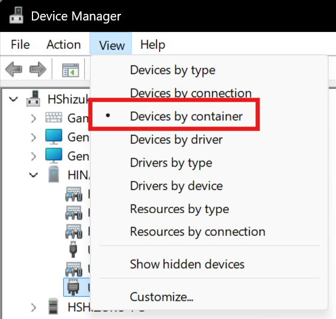
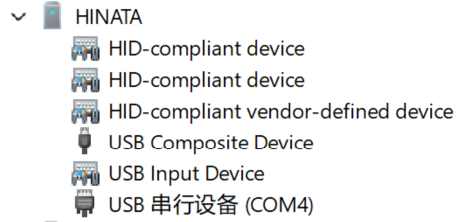

# Connecting Games via SEGA Official Serial Protocol  

## Important Notes  
When using SEGA’s official serial card reader protocol, **the card reader hook in Segatools must be disabled**.  
If the game fails to connect to the card reader after disabling the hook (e.g., due to misconfiguration), the game will disconnect from the network. A game restart is required after fixing the issue.  

## Card Reader Port Configuration  

| Game         | Default Port |  
| :----------- | :----------- |  
| maimai DX    | COM1         |  
| ONGEKI       | COM1         |  
| CHUNITHM     | COM4         |  

1. Identify and note the **port number** for your game. The table above shows default ports for common games. For other games using *amdaemon*, check or modify the port in `config_common.json` ([details](com_port.md)).  
2. Ensure the target port is not occupied by other devices:  
   1. Open Windows **Device Manager** (default view: *Devices by type*). Enable **Show hidden devices**:  
        
   2. **Unplug the card reader** and locate the **Ports (COM & LPT)** dropdown:  
        
   3. If no ports are listed, proceed. If ports exist, check for conflicts.  
   4. For conflicting devices: Right-click → **Properties → Port Settings → Advanced** → Change **COM Port Number** to an unused value (e.g., COM255):  
        
3. **Plug in the card reader**, switch to *Devices by container* view:  
     
4. Locate **HINATA**:  
     
5. Right-click **USB Serial Device** → **Properties → Port Settings → Advanced**.  
6. Set **COM Port Number** to your game’s required port. *No baud rate adjustment is needed* (uses USB CDC class).  
7. Verify port conflicts under *Devices by type* → **Ports (COM & LPT)**.  
8. **Reboot the card reader**: Replug it or disable/enable **USB Serial Device** in Device Manager.  

## Game Configuration  
1. Ensure the game is **online** (green globe icon visible). Network setup is beyond this guide’s scope.  
2. Edit `segatools.ini`:  
   ```ini
   ; Add this section if missing:
   [aime]
   enable=0 
   ; Disables Segatools card reader hook (mandatory for serial protocol)

   ; Comment/delete any [aimeio] section (e.g., if used with HINATA’s AimeIO mode):
   ;[aimeio]
   ;path=hinata.dll
   ```  
3. *Baud rate changes are unnecessary* (USB CDC class used).  
4. Launch the game.  

## Related Guides  
* [Adjust LED Brightness in Serial Mode](../HCP/index.md)  
* [Connecting Games via AimeIO](aimeio.md)  
* [In-Game Card Reader Test](in_game_test.md)  
* [KONAMI Game Setup](../KONAMI/index.md)  