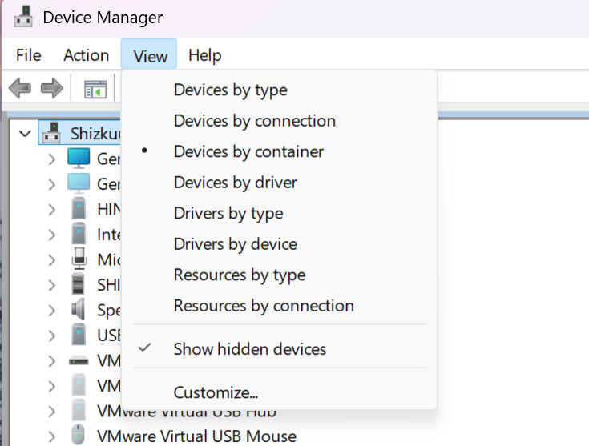
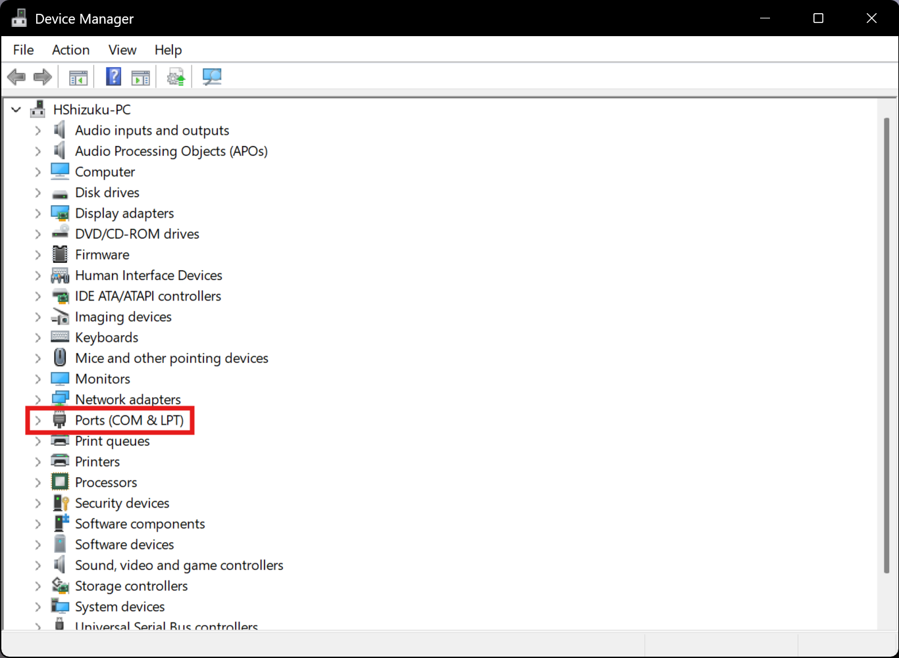

# SEGA Official Serial Protocol Connection

::: warning
When using the SEGA official serial reader protocol, you need to close Segatools' reader hook.

If the game fails to connect to the reader after closing the hook (for example, due to incorrect port configuration), the game will directly disconnect from the network. Please restart the game after confirming the configuration is correct.
:::

## Reader Port Configuration

| Game | Default Port Number |
| :--: | :----------------: |
| maimai DX | COM1 |
| ONGEKI | COM1 |
| CHUNITHM | COM4 |

### Port Confirmation and Release

1. First, confirm the **serial port number** used by the game you are playing and note this value.  
   The table above shows the default port numbers for common games.

   For other games using AMDaemon, you can view or modify the port number in `config_common.json`:  
   [View or Modify Serial Port Number](com_port.md)

2. Open Windows **Device Manager**, keep the default "View devices by type" view, and check  
   **View → Show hidden devices**

   

3. **Unplug the reader** and check if there is a `Ports (COM and LPT)` category

   

   - If there is no such category, you can directly skip to the next section  
   - If it exists, expand it and check if the target port number is occupied by other devices

4. If the port is occupied, right-click the device and go to  
   **Properties → Port Settings → Advanced**

   

5. Change the `COM Port Number` of that device to another rarely used port (e.g., COM255)

### Set Reader Port Number

6. **Insert the reader**, switch Device Manager to **View devices by container**

   

7. Find **HINATA**

   

8. Right-click `USB Serial Device`, go to  
   **Properties → Port Settings → Advanced**

9. Change the `COM Port Number` to the port number required by the corresponding game.  
   Since the reader uses *USB CDC* class for serial communication, typically **no need to modify the baud rate**.

10. After modification, it is recommended to switch back to **View devices by type** and confirm again:
    - The reader port does not conflict with other devices

11. **After modification, please be sure to unplug and replug the reader once**.  
    If it's the first configuration, it is recommended to restart the computer once;  
    or disable and re-enable the `USB Serial Device` in Device Manager.

## Game Configuration

::: tip
Please ensure the game has been successfully connected to the network.  
After entering the game, it should display a **green globe icon**, otherwise please complete the network configuration first (not discussed in this article).
:::

1. Open `segatools.ini` and modify the configuration as follows:

   ```ini
   ; If there is no [aime] section, please add it manually
   [aime]
   enable=0
   ; enable=0 is used to close Segatools' reader hook
   ; Must be set this way when using official serial IO

   ; If there is an [aimeio] section (for example, if you have used HINATA's AimeIO mode,
   ; or mageki / nageki, etc.), please comment it out or delete it directly
   ;[aimeio]
   ;path=hinata.dll
   ```

2. Since the reader uses *USB CDC* class for serial communication, typically **no need to modify baud rate settings**

3. Start the game

## Other Pages

* [Adjust Light Brightness in Serial Mode](../HCC/index.md)
* [AimeIO Method for Connecting SEGA Games](aimeio.md)
* [Test Reader in Game](in_game_test.md)
* [KONAMI Game Settings](../KONAMI/index.md)
