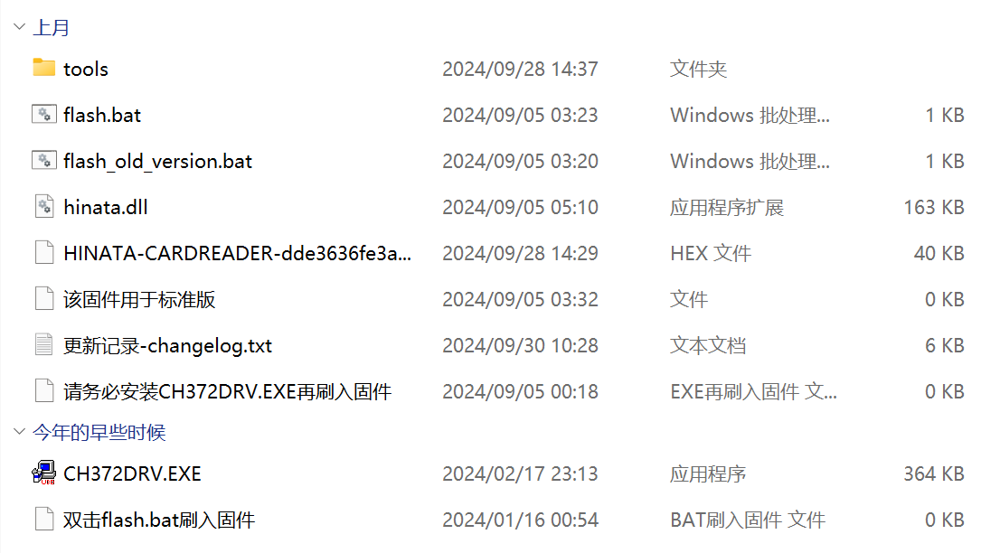

# Firmware Update

* **HINATA** is shipped with the latest stable firmware pre-installed as of the shipping date. If the card reader is functioning properly and you are not interested in new features, you do not need to update.
* The control center currently does not have a one-click firmware update feature; firmware updates require downloading an update package.
* Update packages for **HINATA** are provided on [GitHub](https://github.com/nerimoe/HINATA-release/releases).  

## Update Method

1. First, extract the update package.
2. Install `CH372DRV.EXE`.
3. Double-click `flash.bat` and follow the prompts in the script to update the firmware.