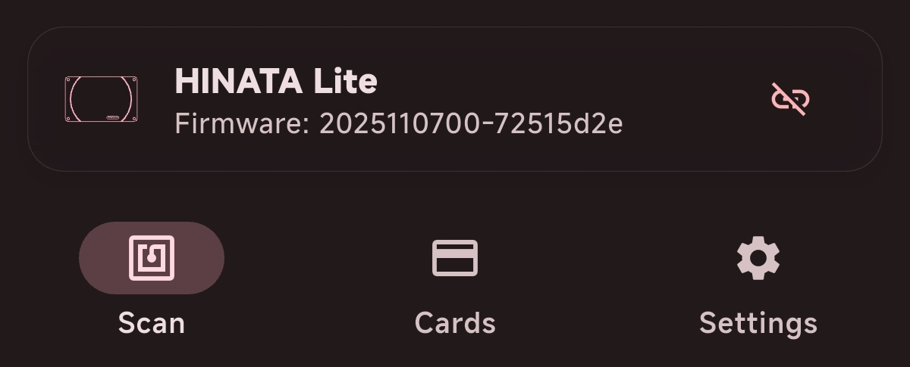
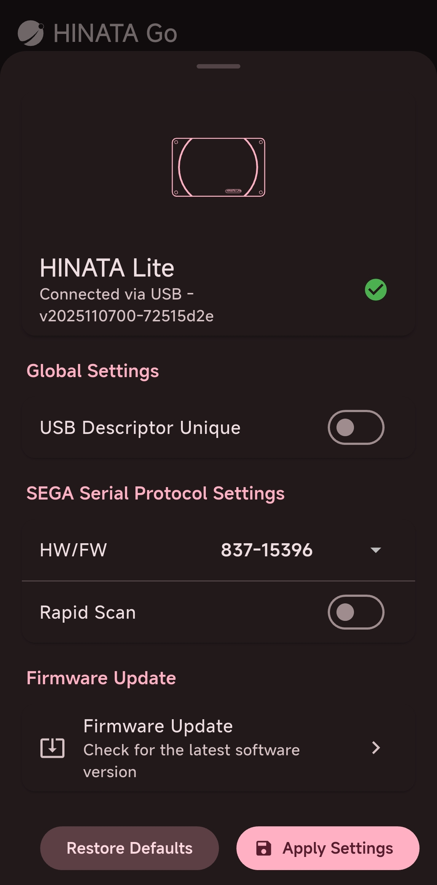

# Manage HINATA Card Reader

If you need to change card reader settings, check device status, or update firmware, start here.

Most card reader management operations will be completed via **HINATA Go**. HINATA Go is a multi-platform NFC card tool that supports card information viewing (Normal Mode) and card reader mode (Sender Mode); when it runs on platforms that support connecting to a physical card reader, it can directly connect to the HINATA reader to change device settings.

On Windows, card reader settings can still be modified through the HINATA Go web version; however, firmware updates require the use of **HINATA Client**.

## What You Can Do

- Check card reader connection status and firmware version
- Change card reader settings, such as working mode, card reading limits, etc.
- Update card reader firmware for new features and stability improvements
- Check if the card reader is working properly before connecting to a game or third-party ecosystem

## Which Tool Should You Use?

If you just want to modify the card reader settings or check the device status, please use the **HINATA Go Web Version** or **HINATA Go App**.

- Windows / macOS / Linux / ChromeOS can use the HINATA Go web version
- Android / iOS can use the HINATA Go App

If you want to update the firmware, you need to choose the method based on your current device:

- Android / iOS / macOS / Linux / ChromeOS can update using HINATA Go
- Windows needs to update using HINATA Client

If you are just using the card reader to play games, you usually do not need to open these tools every time; you only need to open them during first use, when changing settings, updating firmware, or troubleshooting issues.

## Connect to Card Reader using HINATA Go

  
  

## Connect the Card Reader

Use a data cable to connect your device to the HINATA card reader so that HINATA Go can access it.

## Enter Card Reader Details

After connecting, tap this bar at the bottom of the screen to enter the details page:

The details page is shown below. You can change settings, update firmware, or check the HINATA card reader status here.

## Update Firmware using HINATA Client

If you are using Windows, please refer to the [Firmware Update](/en/update/) page to update the card reader firmware using HINATA Client.
