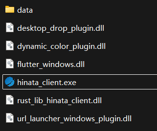
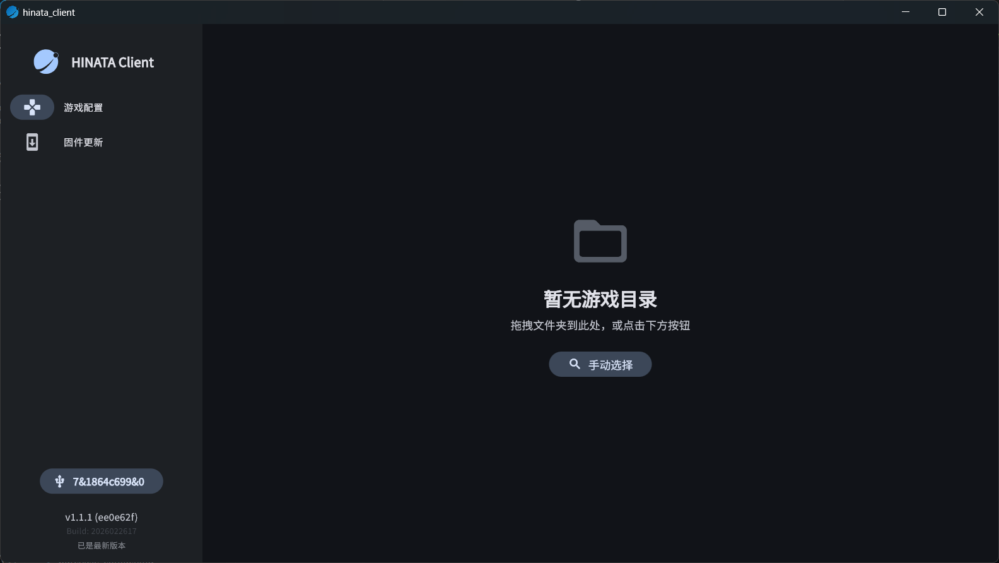
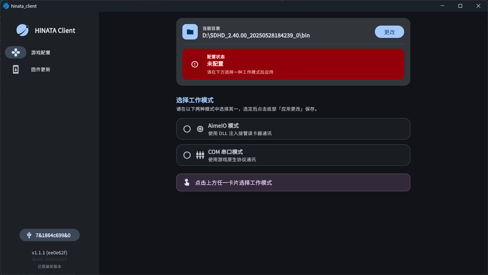

# Configure SEGA Games Using HINATA Client (Recommended)

## Download HINATA Client

<Links
  :items="[
    {
      name: 'HINATA Client',
      link: 'https://gh-proxy.org/https://github.com/nerimoe/hinata_client-pub/raw/refs/tags/stable/release.zip',
      linkText: 'Download Now'
    }
  ]"
/>

## Getting Started

After extraction, the following files should be present:

Double-click `hinata_client.exe` to open HINATA Client.

## Configure Game

1. Follow the prompt to drag and drop or manually select the folder. This folder must contain `segatools.ini`.

   Typically: The `bin` folder for CHUNITHM, and the `Package` or `AMDaemon` folder for maimai.

   

2. Follow the prompt to select the working mode. Selecting a mode will display its pros and cons, along with [Optional Advanced Settings](advanced.md).

   

3. Click the `Apply Changes` button to finish the setup, then you can start using the card reader.
