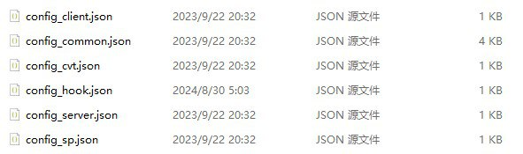
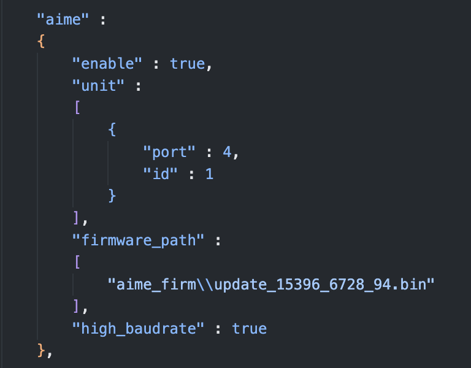

# Modifying the Required Game Port Number

::: info
**If you don't need to switch back and forth between playing "CHUNITHM" and "maimai / ONGEKI", and have no other special requirements, you can safely skip this section.**
:::

::: warning
This guide **only applies to users connecting via the Official SEGA Serial Protocol**.
If you modified the configuration files following the tutorial below, but later want to use `Virtual Swiping (Enter Key)` or `AimeIO`,
please make sure to restore the configuration files to their default settings, otherwise they will not work properly.
:::

## Introduction

| Game | Default Port Number |
| :--: | :--: |
| maimai DX | COM1 |
| ONGEKI | COM1 |
| CHUNITHM | COM4 |

The above are the default port numbers for the three games, but **they are not fixed**. Users can change the card reader port number used by the game by modifying the configuration file.

Consider this scenario:
You only have one computer and one card reader, but want to play multiple SEGA rhythm games.
Since maimai and ONGEKI have the same default port number, you usually only need to set it up once.
However, CHUNITHM's port number is different, which is why this tutorial is necessary.

Currently, most SEGA games use `AMDaemon`, and card reader related settings are uniformly managed by `AMDaemon`.
Players can change the card reader port number required by the game by modifying the configuration file passed to `AMDaemon`.

## Modifying the Files

### File Introduction

The following are the `AMDaemon` configuration files that might exist in a normal game directory:



- `config_client.json`, `config_server.json`
  Related to the delivery server, can be ignored in this article.
- `config_hook.json`
  Comes with Segatools, used to forcibly override some settings.
- `config_cvt.json`, `config_sp.json`
  **CHUNITHM exclusive configuration files.**
- `config_common.json`
  Configuration file common to all games.

Usually, the card reader port number configuration is located in `config_common.json`.
But for **CHUNITHM**, you need to modify `config_cvt.json` or `config_sp.json` depending on the cabinet you use at startup.

### How to Modify

Open `config_common.json` or `config_cvt.json / config_sp.json`, search downwards for the `aime` entry:



Among them:

```json
"port": 4
```

The `4` here is the port number used by the card reader (corresponding to COM4).
You can change it to **any other port number that is not occupied by an official device**.

::: tip What are the "other port numbers used by official devices"?

Taking **CHUNITHM** as an example, SEGA officially uses `COM1` to connect the *Ground Slider* (ground touch panel).
Therefore, **you cannot use COM1** when modifying the card reader port number.
:::

Here are the **port numbers officially occupied but unavailable for the card reader** in common games:

| Game | Occupied Port Numbers and Uses |
| :--: | :-- |
| maimai DX | COM2: VFD Screen<br>COM3 / COM4: 1P / 2P Touch Screen<br>COM21 / COM23: Lighting Board |
| ONGEKI | COM2: VFD Screen<br>COM3: Lighting Board |
| CHUNITHM (SP) | COM1: Touch Panel<br>COM2: VFD Screen<br>COM20 / COM21: Lighting Board |
| CHUNITHM (CVT) | COM1: Touch Panel<br>COM2 / COM3: Lighting Board |

The port numbers above **cannot be used for the card reader port**.

## Use Case

Requirement:
I only have one computer and one card reader, but want to switch back and forth between playing **CHUNITHM** and **maimai**.

You can follow these steps:

1. Edit `config_common.json` of maimai and change the card reader port number to `COM7`.
2. Edit `config_cvt.json` or `config_sp.json` of CHUNITHM and similarly change the card reader port number to `COM7`.
3. Open Windows Device Manager, change the actual port number of the card reader to `COM7` as well, and re-plug the card reader.

Once completed, you can switch between the two games without having to repeatedly change the card reader port number.
