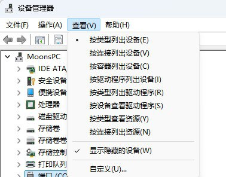
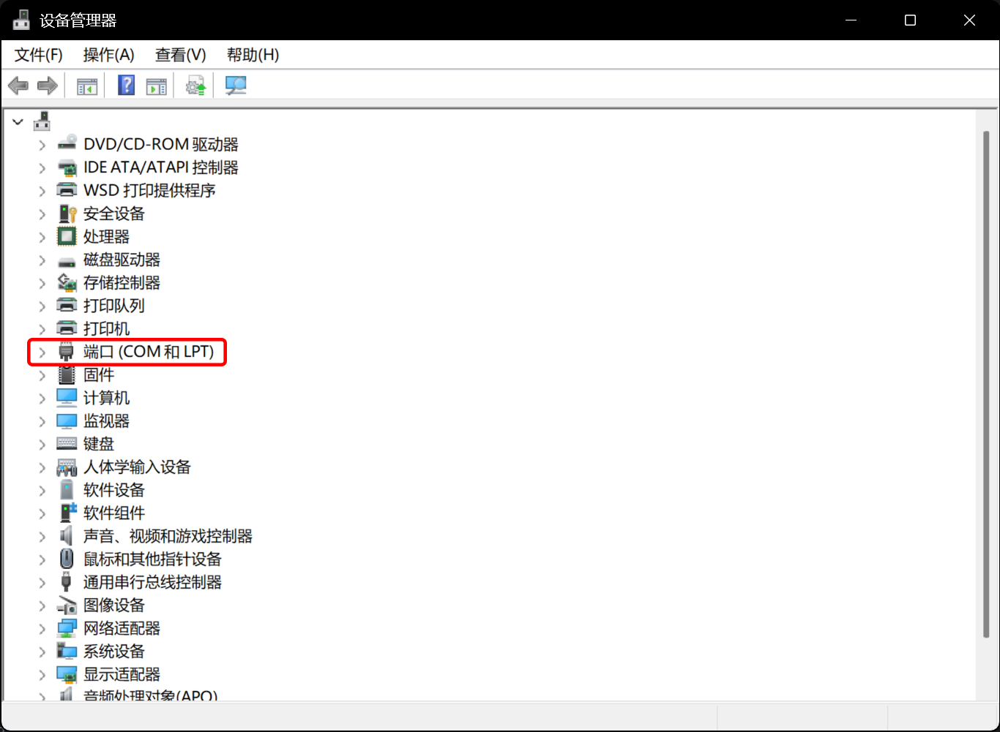
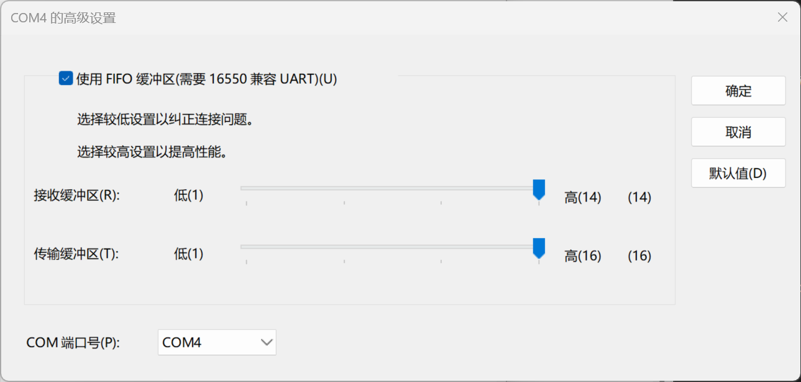

# Connecting to the Game via Official SEGA Serial Protocol

::: tip Note
When using the official SEGA serial card reader protocol, you need to disable Segatools' card reader hook.

If the game fails to connect to the card reader after disabling the hook (for example, due to incorrect port number configuration), the game will directly disconnect from the network.
Please restart the game after confirming the configuration is correct.
:::

## Reader Port Configuration

| Game | Default Port Number |
| :--: | :--------: |
| maimai DX | COM1 |
| ONGEKI | COM1 |
| CHUNITHM | COM4 |

### Confirm and Release Port

1. First, confirm the **serial port number** used by the game you are playing and record that value.
   The table above shows the default port numbers for common games.

   For other games that use AMDaemon, you can view or modify the port number in `config_common.json`:
   [View or modify the serial port number](com_port.md)

2. Open Windows **Device Manager**, keep the default "Devices by type" view, and check
   **View → Show hidden devices**

   

3. **Unplug the card reader** and check if there is a `Ports (COM & LPT)` category.

   

   - If there is no such category, you can skip directly to the next section.
   - If it exists, please expand it and check if the target port number is occupied by other devices.

4. If the port is occupied, right-click the device and go to
   **Properties → Port Settings → Advanced**

   

5. Change the `COM Port Number` of the device to another uncommonly used port (e.g., COM255).

### Set Card Reader Port Number

6. **Plug in the card reader** and switch Device Manager to **Devices by container**

   

7. Find **HINATA**

   

8. Right-click `USB Serial Device` and go to
   **Properties → Port Settings → Advanced**

9. Change the `COM Port Number` to the port number required by the corresponding game.
   Since the card reader uses the *USB CDC* class for serial communication, there is usually **no need to modify the baud rate**.

10. After the modification is complete, it is recommended to switch back to **Devices by type** and confirm again:
    - The card reader port does not conflict with other devices.

11. **After making changes, be sure to unplug and plug the card reader back in once**.
    If it's your first time configuring it, we recommend restarting your computer once;
    Or disable and then re-enable the `USB Serial Device` in Device Manager.

## Game Configuration

::: tip
Please ensure the game can connect to the network normally.
After entering the game, it should display a **green globe icon**. Otherwise, please complete the network configuration first (this is out of the scope of this article).
:::

1. Open `segatools.ini` and modify the configuration as follows:

   ```ini
   ; If there is no [aime] entry, please add it manually
   [aime]
   enable=0
   ; enable=0 is used to disable Segatools' card reader hook
   ; It MUST be set this way when using the official serial IO

   ; If an [aimeio] entry exists (for example, if you used HINATA's AimeIO mode,
   ; or mageki / nageki, etc.), please comment it out or delete it directly
   ;[aimeio]
   ;path=hinata.dll
   ```

2. Since the card reader uses the *USB CDC* class for serial communication, you usually **do not need to modify the baud rate settings**.

3. Start up the game.

## Other Pages

* [Connecting to SEGA games via AimeIO](../aimeio/index.md)
* [In-game card reader test](../../in_game_test.md)
* [KONAMI Game Settings](../../../konami/index.md)
