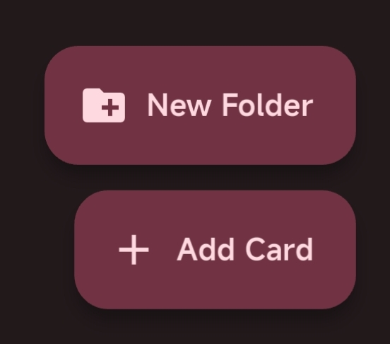
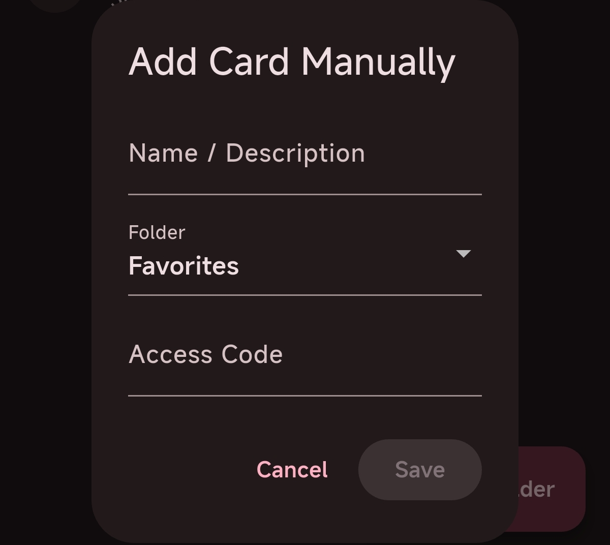

# Card Management

Switch to the **Cards** section to manage cards.

## Folders

By default, there is 1 folder: **Favorites**  
Plus **History**  
**Favorites** is the default folder of the application, which can save cards or add cards for use.  
**History** saves cards that have been scanned before for use.

### Add Card

Click the **Add Card** button at the bottom right to enter the manual card addition interface.

Access Code must be **a 20-digit number not starting with 3**