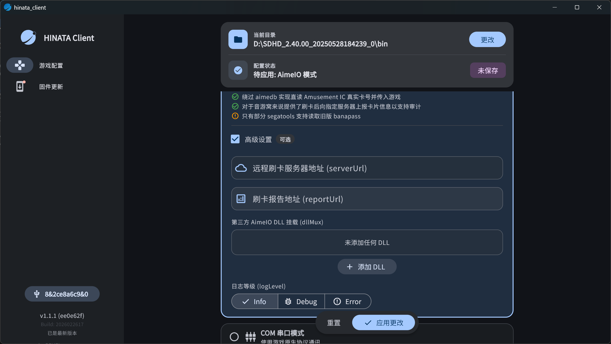

# Card Reader Mode

## SEGA Game Configuration

> **The following configuration uses the HINATA public card reader server ( `aime-ws.neri.moe` ) as an example. Please ensure your network environment can access Cloudflare services.**

### Configure Segatools

1. First, deploy [HINATA AimeIO](/en/game-setting/sega/hinata-client/) to your game. Then configure the remote card swiping server, either by directly editing the text file or by using the HINATA Client GUI.
    ```ini
    [aime]
    enable=1

    [aimeio]
    path=hinata.dll
    serverUrl=wss://aime-ws.neri.moe/REPLACEME
    ```

    

    **Replace `REPLACEME` with a custom English string and make sure it is unique enough to avoid conflicts with others.**
2. Download the latest version of HINATA Go from [Download](/en/go/index.md#download), install, and open it.
3. Add an Instance in the app. Choose any name and set the URL to `https://aime-ws.neri.moe/REPLACEME`, as shown below: 

4. Start the game and play.

## KONAMI Game Configuration

### SpiceAPI
> **Currently, no forwarding server has been set up for SpiceAPI, so it can only be used on a local network. You can also use cloudflared to forward it yourself.**
1. Run `spicecfg.exe`.
2. Find the SpiceAPI configuration, set the port, and leave the password blank.
3. Add an Instance in HINATA Go and set the URL to `<Your_IP_Address>:<Spice_Listening_Port>`, for example `192.168.0.114:1145`. Do not include `http://`.

## Send Card Number to Game

### Normal Mode

After scanning a card in **Normal Mode** (Card Information Viewer screen), scroll down to find two buttons. Tap the **Send** button on the right, and select the target instance to send the card number to the game.


### Sender Mode

Switch to the **Sender Mode** tab in HINATA Go, and select the active game instance. In this mode, scanning a card via the device's built-in NFC, QR/barcode scan, or a connected external HINATA card reader will send the card number automatically and in real time to the selected instance without any manual steps.


