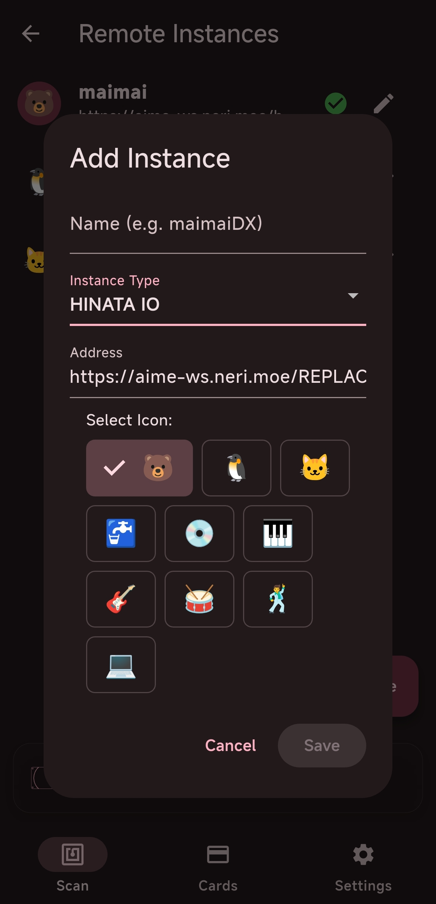
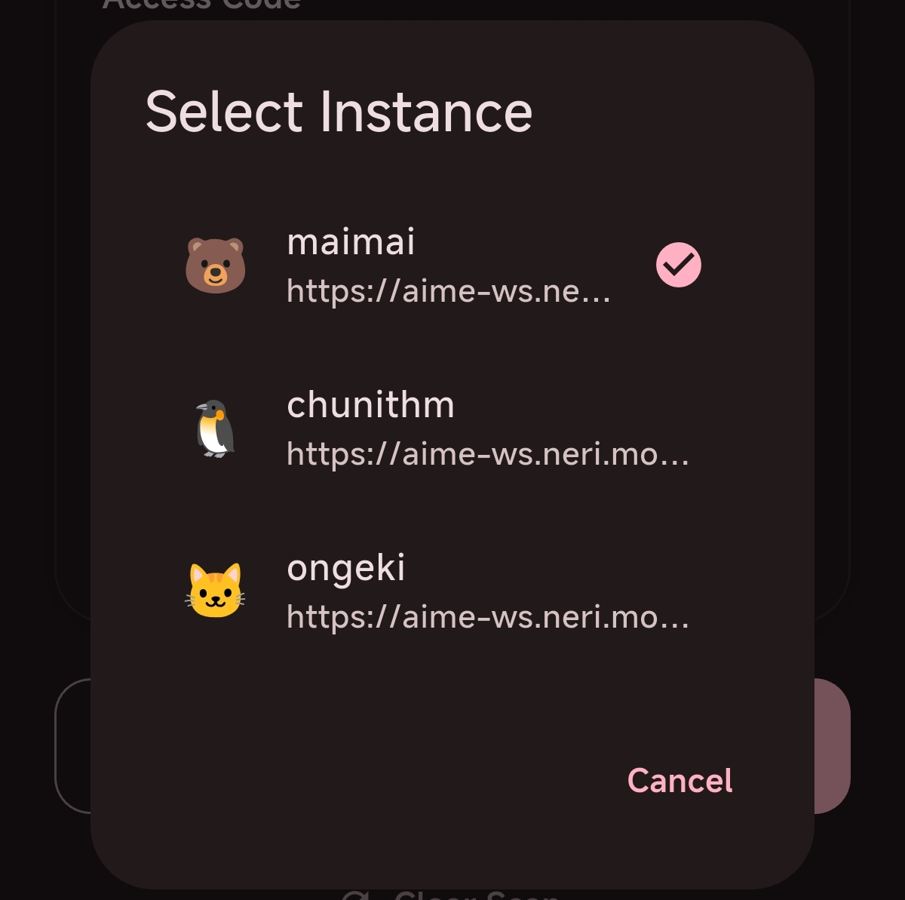
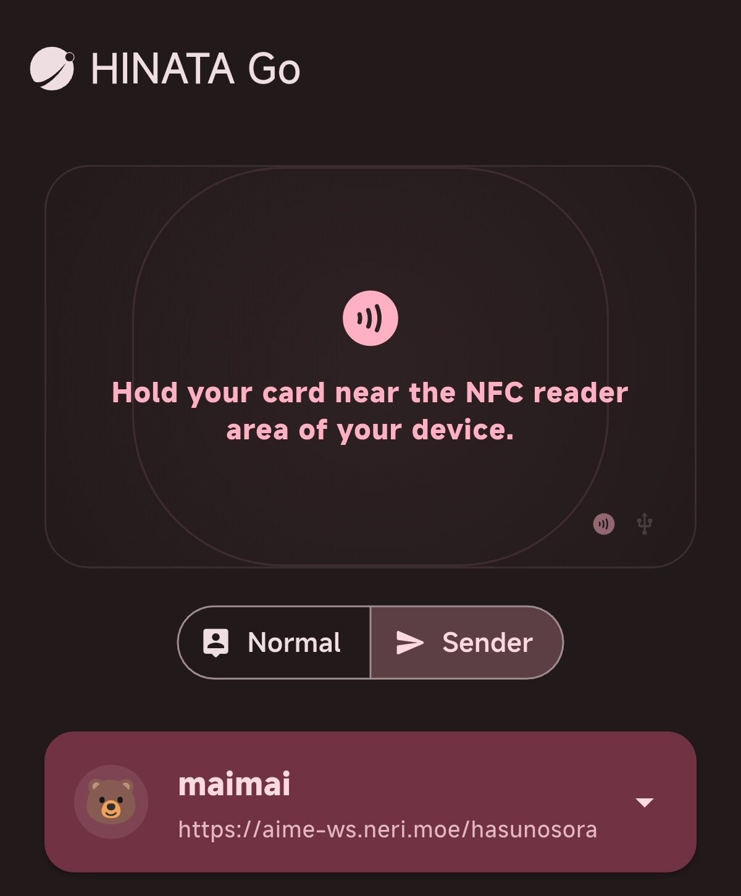

# Connect to Arcade Games as a Card Reader

## SEGA Game Configuration

> **The following configuration uses the HINATA public card reader server ( `aime-ws.neri.moe` ) as an example. Please ensure your network environment can access Cloudflare services.**

### Configure Segatools

1. First, deploy [HINATA AimeIO](/en/game-setting/sega/aimeio/) to your game. Then configure the remote card server. You can edit the `segatools.ini` directly.
    ```ini
    [aime]
    enable=1

    [aimeio]
    path=hinata.dll
    serverUrl=wss://aime-ws.neri.moe/REPLACEME
    ```

    **Replace `REPLACEME` with your custom serial string, and make sure it's unique enough to avoid conflicts with others.**
2. Download the latest version of HINATA Go from [Download](/en/go/index.md#download), install, and open it.
3. Add an Instance in the app, customize the name, and configure the URL as `https://aime-ws.neri.moe/REPLACEME`, as shown below 
4. Run the game and start your experience.

## KONAMI Game Configuration

### SpiceAPI
> **⚠️ Since there is currently no forwarding server set up for SpiceAPI, it can only be used on a local network. Well, you can also use cloudflared for forwarding yourself.**
1. Run `spicecfg.exe`.
2. Find the SpiceAPI configuration, set the port, and leave the password blank.
3. Add an Instance in HINATA Go, configure the URL as `<Your_IP_Address>:<Spice_Listening_Port>`, e.g. `192.168.0.114:1145`. No need to add `http://` from the begin.

## Send

### Normal Mode

After scaning the card, slide down to see two buttons. Click the **SEND** button on the right and select the instance to read the card.




### Sender Mode

Please select the instance first, then use the device's NFC to scan the card. It will automatically send after scaning.

