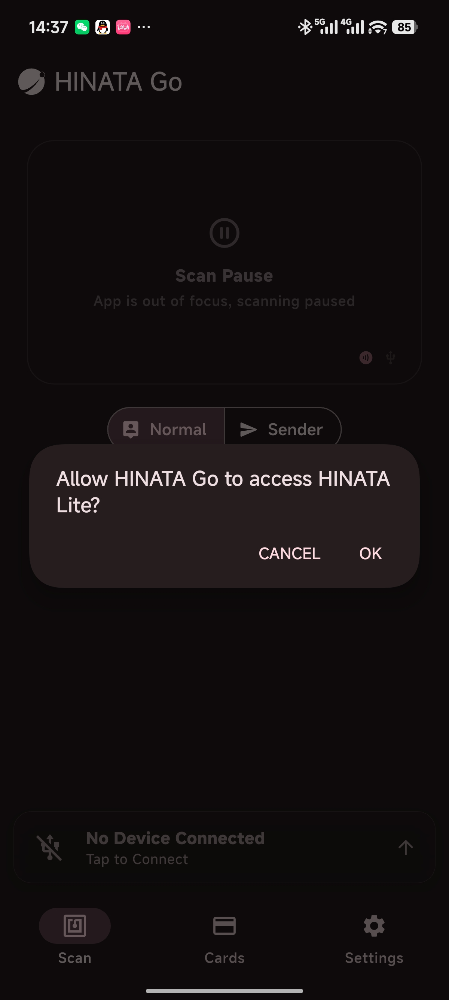

# Configure & Update HINATA Card Reader

## Connection

Use a data cable to connect the mobile device to the HINATA Card Reader, so that the mobile device can access the HINATA Card Reader.

A window may pop up as shown below. Please click OK.

## Usage

After connection is complete, you can click this bar at the bottom of the screen to enter the detailed interface:

The detailed interface is as follows. You can configure or update the HINATA device here.

