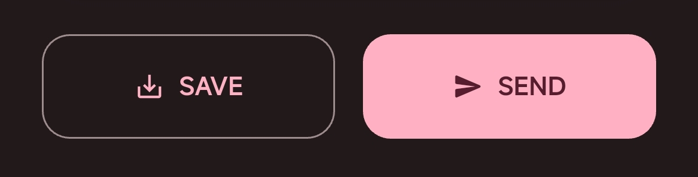
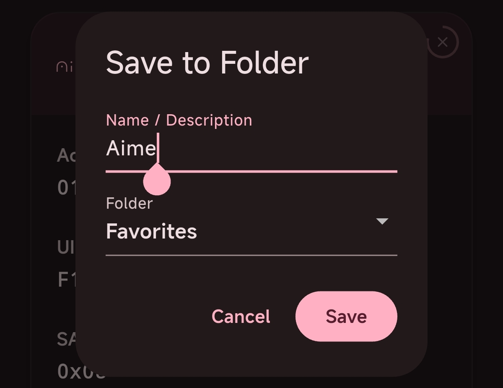
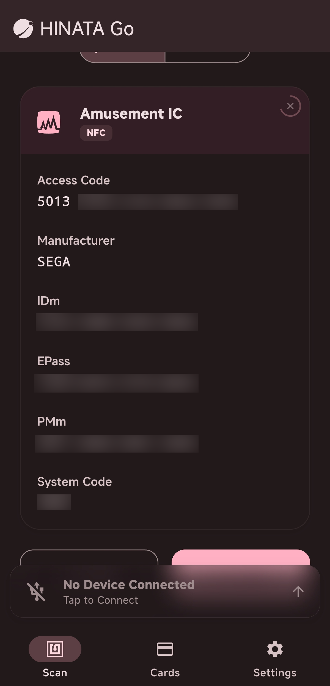
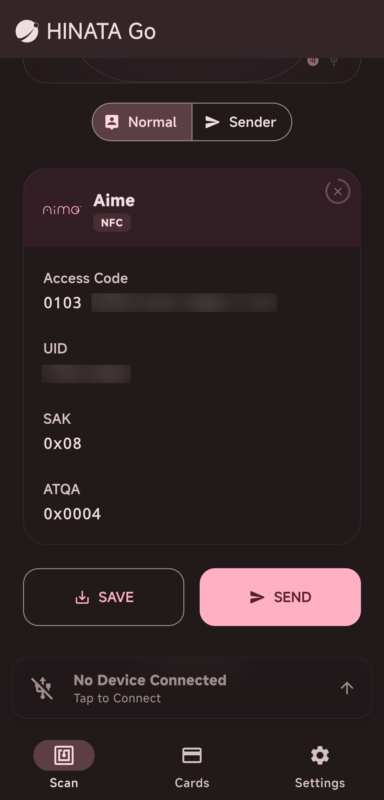
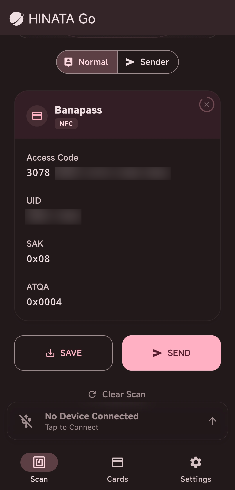

# Read Card Information

## Readable Card Types

* [**Amusement IC**](#amusement-ic)
* [**Legacy Aime**](#legacy-aime-most-aime-compatible-cards)
* [**Bandai Namco Passport**](#bandai-namco-passport-bana-passport)
* **E-Amusement Pass**
* **FeliCa**

## How to Read

Place the card on the NFC recognition area of the mobile device to read the card information, as shown:

Or connect to the HINATA Card Reader for recognition, as shown:

## Save Card

After swiping the card, slide down to see two buttons. Click the save button on the left and customize the name and folder to save.

## Read Information

### Amusement IC

### Legacy Aime / Most Aime Compatible Cards

### Bandai Namco Passport / BANA PASSPORT

