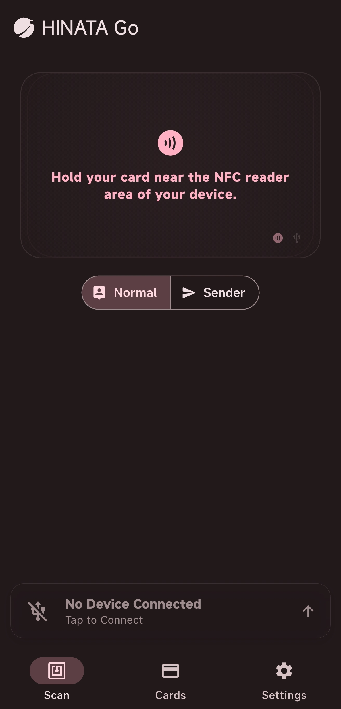

# HINATA Go

<Links
  :items="[
    {
      name: 'HINATA Go Repository',
      link: 'https://github.com/Project-HINATA/hinata_go',
      linkText: 'Click Here'
    }
  ]"
/>

## What is HINATA Go?

While connecting via HINATA AimeIO, turns your mobile phone into a card reader or QR code scanner for arcade games, and can be used with various other devices.

## Download

| iOS | Android |
| --- | ------- |
|  | [**APK Download**](https://github.com/nerimoe/hinata_go/releases) |

## Interface

As shown in the figure, after installing and opening the application, the UI interface should look like this.

## Features

<Links
  :items="[
    {
      name: 'Read Card Information',
      link: 'features/read-card-info',
    }
  ]"
/>
<Links
  :items="[
    {
      name: 'Connect to Arcade Games as a Card Reader',
      link: 'features/game-connection',
    }
  ]"
/>
<Links
  :items="[
    {
      name: 'Configure & Update HINATA Card Reader',
      link: 'features/hinata-card-reader',
    }
  ]"
/>
<Links
  :items="[
    {
      name: 'Card Management',
      link: 'features/cards',
    }
  ]"
/>