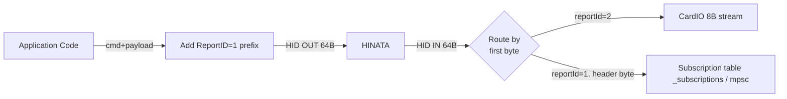
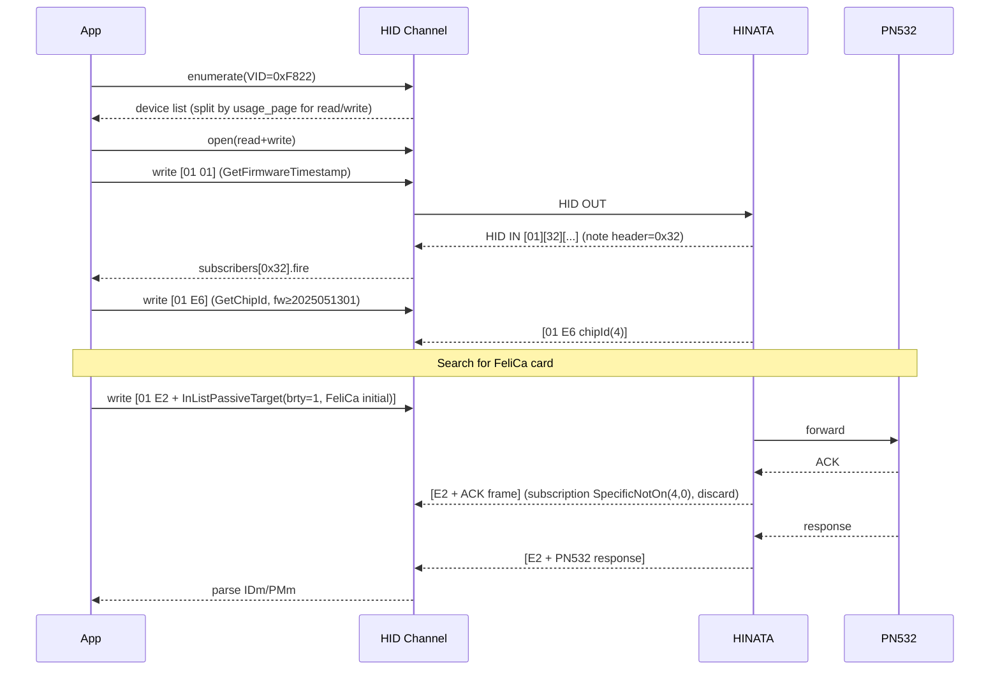

# HID Communication Protocol

> This page describes the HID layer communication protocol, device discovery, frame structure, command bytes, and subscription/distribution model for the HINATA card reader, intended for developers who wish to implement their own host software or integration.

Reference implementations:

- [hinata-rs](https://github.com/Project-HINATA/hinata-rs) — Desktop Rust, based on hidapi.
- [hinata_go](https://github.com/nerimoe/hinata_go) — Flutter, bridging WebHID (desktop/web) and Android `quick_usb`.

Both implementations are protocol-layer identical; differences exist only in the underlying HID channel encapsulation.

---

## 1. Device Identification

| Field | Value |
|---|---|
| **Vendor ID (VID)** | `0xF822` (decimal `63522`) |
| **Product ID (PID)** | Not fixed (returned by device, serves as machine type identifier) |
| **Manufacturer String** | `NERI` (used by Linux udev rules for matching) |
| **HID Report Size** | 64 bytes |
| **HID Report ID (write)** | `0x01` |
| **HID Report ID (CardIO input)** | `0x02` (8 bytes only, special purpose) |

### 1.1 Platform-Specific Lookup Logic

| Platform | Lookup / Matching Method | Endpoint Structure |
|---|---|---|
| **Windows / Linux** | hidapi enumeration: VID=`0xF822`, differentiate by `usage_page` | **Dual interface**: `usage_page == 0x01` → **READ**, `usage_page == 0x06` → **WRITE** |
| **macOS** | hidapi enumeration: VID=`0xF822`, take only `usage_page == 0x06` | **Single interface** (read/write shared) |
| **Android** | `quick_usb` enumeration: VID=`0xF822`, scan all interfaces (skip class `2` CDC, class `10` CDC-Data), claim and split by endpoint direction into IN/OUT | Bulk IN + Bulk OUT endpoints |
| **Web** | `navigator.hid` (`neo_web_hid`), filter `{ vendorId: 0xF822 }` | Browser WebHID API |

Windows device instance-id is obtained by splitting the hidapi path on `#` (used to pair the read/write interfaces of the same device). Windows also crawls up via SetupAPI / `CM_Get_Parent`, then `CM_Get_Child` to find sibling nodes with ClassGuid `Ports` (used to map the corresponding `COMx`).

### 1.2 Linux udev Rule

```
ATTRS{manufacturer}=="NERI", MODE="0666"
```

### 1.3 Android USB Filter

```xml
<usb-device vendor-id="63522" />   <!-- 0xF822 -->
```

---

## 2. HID I/O Model



### 2.1 Write Frame (Host → Reader)

```
[ReportID=0x01] [CMD] [PAYLOAD ...]   total length ≤ 64
```

- hidapi/WebHID: `device.write([0x01, cmd, ...payload])` or `sendReport(1, payload_with_cmd_at_offset_0)`
- Android Bulk OUT: `bulkTransferOut(write_ep, [0x01, cmd, ...payload])`

### 2.2 Read Frame (Reader → Host)

64-byte HID input report, **first byte = ReportID**:

| ReportID | Meaning | Parsing |
|---|---|---|
| `0x01` | Normal command response | `data[1]` = response header (generally equals sent CMD, exceptions below), `data[2..]` = payload |
| `0x02` | CardIO input | 8-byte card ID data, independent callback stream |

**Exception**: When sending `CMD=0x01` (GetFirmwareTimestamp), **response header = `0x32`**.

```rust
// builder.rs
if data[1] == 1 { 50 } else { data[1] }
```

```dart
// hinata_device.dart
if (command == 1) responseHeader = 0x32;
```

Reference: [`builder.rs`](https://github.com/Project-HINATA/hinata-rs/blob/main/src/builder.rs), [`hinata_device.dart`](https://github.com/nerimoe/hinata_go/blob/main/lib/services/hardware/core/hinata_device.dart).

### 2.3 Why a Subscription Mechanism Is Needed

The HINATA main protocol (`0x01` ReportID channel) **has no packet-level sequence numbers / transaction IDs / correlation fields**—unlike the Sega protocol where the `SEQ` byte can bind a response back to a request one-to-one. The only field in a response frame that can distinguish "whose reply is this" is the first byte (the header, ≈ original CMD). This creates several problems that must be handled:

1. **Concurrent requests collide**: If two `GetConfig(0xD4)` commands are sent simultaneously, both responses have header `0xD4`, making it impossible to distinguish their order by protocol fields alone; the upper layer must serialize them.
2. **Asynchronous pushes and synchronous responses share the same channel**: The firmware may actively push data (subscription-style data, e.g., ACK + actual response in PN532 passthrough, CardIO streams), so not all IN frames are "the response to the previous OUT".
3. **Multi-frame responses / intermediate frames need to be discarded** (typical: PN532 first returns ACK `00 00 FF 00 FF 00`, then returns the actual data frame)—a naive "send one, receive one" model will get the wrong frame.
4. **Response header does not always equal request CMD**: The reply to `CMD=0x01` has header `0x32`; the subscription must explicitly declare the expected header.

Both reference implementations adopt the same approach: **route by header byte + each subscription carries a "when to remove" policy**. This is equivalent to adding a transaction manager in the host software layer to compensate for the lack of protocol-level SEQ. Comparison:

| Dimension | Sega Protocol (`0xE0`) | HINATA Main Protocol (other CMDs) |
|---|---|---|
| Packet contains `SEQ` number | ✅ Increments per packet, precise pairing | ❌ None |
| Response-to-request relationship | Bound directly by `SEQ` | Matched only by header byte |
| Multi-frame / ACK frame handling | Rarely occurs in protocol | Must be filtered by subscription policy |
| Unsolicited data pushes | Almost none | Present (CardIO, PN532 async, etc.) |
| Host-side implementation | One frame received = pairing complete | Register subscription → route → remove by policy |

In other words: **the subscription mechanism is a patch for "HINATA main protocol has no SEQ"**—treat the header as a weak correlation key, then use policy to express "when should this transaction end" (once, never, specific byte matches/doesn't match).

### 2.4 Subscription / Unsubscription Policies

The main thread registers `(header_byte → Subscription)` in a map. The I/O thread reads a frame, dispatches it to the corresponding subscription by `data[1]`, and uses the "policy" to decide whether to remove it:

| Policy | Removal Trigger |
|---|---|
| `Count(n)` | After receiving n frames |
| `Never` | Never (for continuous streams) |
| `SpecificIsOn(idx, byte)` | When `data[idx] == byte` |
| `SpecificNotOn(idx, byte)` | When `data[idx] != byte` |

PN532 wrapped commands use `SpecificNotOn(4, 0)` (to filter out PN532's ACK frame `00 00 FF 00 FF 00`, waiting for the actual response frame).

---

## 3. Firmware Layer Command Packet (HINATA Native Protocol)

All commands are sent via `[0x01][CMD][PAYLOAD]` HID OUT. The CMD in the table below is a single byte.

| CMD | Name | Payload (Host→Reader) | Response (Reader→Host, `data[2..]`) | Notes |
|---|---|---|---|---|
| `0x01` | **GetFirmwareTimestamp** | Empty | 10 ASCII bytes, e.g., `"2025051301"`, convert to `u32` | Response header is `0x32` |
| `0x07` | **SetLed** | `[R, G, B]` | None (fire-and-forget) | Set LED immediately |
| `0xD0` | **SetStorage** | `[index, value]` | None | Write persistent storage (NVM/EEPROM) |
| `0xD1` | **GetStorage** | `[index]` | `[value]` (`data[2]`) | Read persistent storage |
| `0xD3` | **SetConfig** | `[index, value]` | None | Write runtime config |
| `0xD4` | **GetConfig** | `[index]` | `[value]` (`data[2]`) | Read runtime config |
| `0xE0` | **SegaTransport** | Sega protocol frame (see §5) | Sega protocol frame | Passthrough to Sega submodule |
| `0xE2` | **PN532Transport** | PN532 frame (see §4) | PN532 frame | Passthrough to PN532 |
| `0xE3` | **GetMainLoopState** | Empty | `[state]` (`data[2]`) | Read firmware state machine |
| `0xE5` | **GetCommitHash** | Empty | 4-byte commit hash (`data[2..6]`) | Firmware ≥ `2025051301` only |
| `0xE6` | **GetChipId** | Empty | 4-byte chip id (`data[2..6]`) | Firmware ≥ `2025051301` only |
| `0xE8` | **ResetStateMachine** | Empty | None | Reset main state machine |
| `0xE9` | **ReloadConfig** | Empty | None | Reload storage into runtime config |
| `0xEA` | **ResetLed** | Empty | None | LED restore to default |
| `0xF0` | **EnterBootloader** | Empty | None | DFU |

### 3.1 Config / Storage Index (`ConfigIndex`)

```
0  segaBrightness   1  config0   2  config1
3  idleR  4  idleG  5  idleB
6  busyR  7  busyG  8  busyB
```

`config0` is a bitfield:

| bit | Meaning |
|---|---|
| 0 | isFirstLaunch |
| 1 | cardioDisableIso14443a |
| 2 | cardioIso14443aStartWithE004 |
| 3 | enableLedRainbow |
| 4 | serialDescriptorUnique |
| 5 | segaHwFw |
| 6 | segaFastRead |
| 7 | isNotFirstLaunch |

### 3.2 Frame Examples

```
SetLed(255,0,0):    01 07 FF 00 00
GetFirmware:        01 01           → resp: 02 32 32 30 32 35 30 35 31 33 30 31 ...  ("2025051301", header 0x32)
GetStorage(idleR):  01 D1 03         → resp: 02 D1 <value>
EnterBootloader:    01 F0
```

---

## 4. PN532 Passthrough (CMD = `0xE2`)

HINATA has a built-in PN532. Pass a standard PN532 information frame directly into the payload.

### 4.1 PN532 Information Frame

```
00 00 FF  LEN  LCS  TFI CMD [DATA...]  DCS  00
```

- `LEN = len(TFI + CMD + DATA) = data.len() + 2`
- `LCS = (~LEN) + 1`, such that `LEN + LCS == 0`
- `TFI = 0xD4` (Host→PN532) / `0xD5` (PN532→Host)
- Response CMD byte increments by 1 (i.e., `host_cmd + 1`)
- `DCS = (~Σ(TFI..DATA)) + 1`, such that `Σ + DCS == 0`
- One preamble/postamble byte = `0x00` at each end

### 4.2 ACK Frame (to be ignored)

```
00 00 FF 00 FF 00
```

PN532 returns an ACK (`LEN=0, LCS=0xFF`) before the actual response. The subscription policy `SpecificNotOn(4, 0)` is used to skip the ACK and wait for the proper response frame where `data[4] != 0`.

### 4.3 PN532 Command Enumeration

| CMD | Name | CMD | Name |
|---|---|---|---|
| `0x00` | Diagnose | `0x46` | InJumpForPsl |
| `0x02` | GetFirmwareVersion | `0x4A` | **InListPassiveTarget** |
| `0x04` | GetGeneralStatus | `0x4E` | InPsl |
| `0x06` | ReadRegister | `0x50` | InAtr |
| `0x08` | WriteRegister | `0x52` | InRelease |
| `0x0C` | ReadGpio | `0x54` | InSelect |
| `0x0E` | WriteGpio | `0x56` | InJumpForDep |
| `0x10` | SetSerialBaudRate | `0x58` | RfRegulationTest |
| `0x12` | SetParameters | `0x60` | InAutoPoll |
| `0x14` | SamConfiguration | `0x86` | TgGetData |
| `0x16` | PowerDown | `0x88` | TgGetInitiatorCommand |
| `0x32` | RfConfiguration | `0x8A` | TgGetTargetStatus |
| `0x40` | **InDataExchange** | `0x8C` | TgInitAsTarget |
| `0x42` | InCommunicateThru | `0x8E` | TgSetData |
| `0x44` | InDeselect | `0x90` | TgResponseToInitiator |
| | | `0x92` | TgSetGeneralBytes |
| | | `0x94` | TgSetMetadata |

### 4.4 Common PN532 Command Payloads

#### InListPassiveTarget (`0x4A`) — Card Detection
- Payload: `[max_tg, brty, initial_data...]`
  - `brty = 0x00` → ISO14443A
  - `brty = 0x01 / 0x02` → FeliCa 212 / 424kbps (`initial_data` generated via `gen_felica_poll_initial_data`)
- FeliCa polling initial data:
  ```
  [0x00, sysCodeHi, sysCodeLo, requestCodeLo, 0x00]
  ```
  Typical polling parameters: `sysCode = 0xFFFF`, `requestCode = 0x0001`; see [`pn532.dart::genFelicaPollInitialData`](https://github.com/nerimoe/hinata_go/blob/main/lib/services/hardware/protocols/pn532.dart).

- Response parsing:
  - `[NbTg, Tg, ...]`
  - **Type A**: `ATQA(2 BE) SAK(1) UID_LEN(1) UID(N)`
  - **FeliCa**: `LEN(1) ResCode(1) IDm(8) PMm(8) [SystemCode(2) ...]`, number of `SystemCode` = `(LEN-18)/2`

#### InDataExchange (`0x40`) — Generic APDU/Mifare/FeliCa Command
- Payload: `[Tg, CMD, DATA...]`
- Response first byte is PN532 error code (see §6), followed by data.

#### Mifare Classic Auth (via InDataExchange)
- `CMD = 0x60` (KeyA) or `0x61` (KeyB)
- `DATA = [block_num, key(6B), uid(4B)]`

#### Mifare Classic Read (via InDataExchange)
- `CMD = 0x30, DATA = [block_num]`
- Response: `[status, 16B block]`

#### Mifare Classic Write (via InDataExchange)
- `CMD = 0xA0, DATA = [block_num, 16B data]`

#### Mifare Ultralight Write
- `CMD = 0xA2`

#### FeliCa Read Without Encryption (via InDataExchange)
- `CMD = len(input)+1` (CMD field in PN532 InDataExchange is repurposed as length here)
- `DATA = [0x06, IDm(8), N_svc, svc[i](2 BE)..., N_blk, blk[i](2 BE)...]`

#### Mifare Command Bytes
```
AuthA=0x60  AuthB=0x61  Read=0x30  Write=0xA0
Transfer=0xB0  Decrement=0xC0  Increment=0xC1  Store=0xC2
UltralightWrite=0xA2
```

#### FeliCa Command Bytes
```
Polling=0x00  RequestService=0x02  RequestResponse=0x04
ReadWithoutEncryption=0x06  WriteWithoutEncryption=0x08
RequestSystemCode=0x0C
```

#### InRelease (`0x52`) / InSelect (`0x54`)
- Payload: `[Tg]`, response first byte = PN532 error code.

### 4.5 Complete Packet Example

Get PN532 firmware version (`GetFirmwareVersion`):

```
HID OUT (64B, pad with zeros):
  01 E2  00 00 FF 02 FE D4 02 2A 00
  └Hdr  └PN532 frame─────────────────

HID IN (header=E2):
  E2  00 00 FF 00 FF 00                                  ← ACK, subscription skips
  E2  00 00 FF 06 FA D5 03 IC VER REV SUP DCS 00         ← Actual response
```

InListPassiveTarget(brty=1, FeliCa, max=1):

```
01 E2  00 00 FF 04 FC D4 4A 01 00 E1 00
```

---

## 5. Sega Protocol Passthrough (CMD = `0xE0`, Sega-mode machines only)

Sega subboard protocol encapsulation is passed through the main frame `0xE0`, with subscription policy `Count(1)`. Complete command parsing is in [`sega_protocol.dart`](https://github.com/nerimoe/hinata_go/blob/main/lib/services/hardware/protocols/sega_protocol.dart); [hinata-rs](https://github.com/Project-HINATA/hinata-rs) provides only the raw `0xE0` channel without parsing internal fields.

### 5.1 Frame Format

```
[LEN] [ADDR=0x00] [SEQ] [CMD] [PLEN] [PAYLOAD ...]
LEN = PLEN + 5
```

`SEQ` is a monotonically increasing packet sequence number (increments by 1 per packet).

### 5.2 NFC Commands

| CMD | Name | CMD | Name |
|---|---|---|---|
| `0x30` | GetFwVersion | `0x60` | ToUpdaterMode |
| `0x32` | GetHwVersion | `0x61` | SendHexData |
| `0x40` | StartPolling | `0x62` | ToNormalMode |
| `0x41` | StopPolling | `0x63` | SendBinDataInit |
| `0x42` | CardDetect | `0x64` | SendBinDataExec |
| `0x43` | CardSelect | `0x70` | FelicaPush |
| `0x44` | CardHalt | `0x71` | NfcThrough |
| `0x50` | MifareKeySetA | `0x80` | ExtBoardLed |
| `0x51` | MifareAuthorizeA | `0x81` | ExtBoardLedRgb |
| `0x52` | MifareRead | `0x82` | ExtBoardLedThinca |
| `0x53` | MifareWrite | `0xF0` | ExtBoardInfo |
| `0x54` | MifareKeySetB | `0xF2` | ExtFirmSum |
| `0x55` | MifareAuthorizeB | `0xF3` | ExtSendHexData |
| | | `0xF4` | ExtToBootMode |
| | | `0xF5` | ExtToNormalMode |

### 5.3 Response Codes

```
0x00 ok          0x01 cardError       0x02 noAccept
0x03 invalidCmd  0x04 invalidData     0x05 sumError
0x06 asicError   0x07 hexError        0x08 sendFin
0x10 isNewReader 0x20 isNewReader3    0xFF unknown
```

### 5.4 CardDetect Response Parsing

```
res[7] = cardNum
if cardNum == 1:
  res[8] = cardType    0x10 = FeliCa, 0x20 = ISO14443A
  res[9] = idLen
  FeliCa : IDm = res[10..18], PMm = res[18..26]
  ISO14A : UID = res[10..10+idLen]
```

### 5.5 Frame Example (StartPolling)

```
05 00 01 40 00
└LEN └ADDR └SEQ=1 └CMD=0x40 (start) └PLEN=0
```

Packed into HINATA main frame: `01 E0 05 00 01 40 00`

---

## 6. PN532 Error Codes (Response First Byte)

```
0x00 None              0x01 Timeout            0x02 CRC
0x03 Parity            0x04 CollisionBitCount  0x05 MifareFraming
0x06 CollisionBitColl  0x07 NoBufs             0x09 RfNoBufs
0x0A ActiveTooSlow     0x0B RfProto            0x0D TooHot
0x0E InternalNoBufs    0x10 Inval              0x12 DepInvalidCmd
0x13 DepBadData        0x14 MifareAuth         0x18 NoSecure
0x19 I2cBusy           0x23 UidChecksum        0x25 DepState
0x26 HciInval          0x27 Context            0x29 Released
0x2A CardSwapped       0x2B NoCard             0x2C Mismatch
0x2D Overcurrent       0x2E NoNad
```

---

## 7. Connection / Send-Receive Complete Flow



### 7.1 Key Code Locations

| Function | Rust Reference | Dart Reference |
|---|---|---|
| Device discovery | [`builder.rs`](https://github.com/Project-HINATA/hinata-rs/blob/main/src/builder.rs) (`find_devices_inner`) | [`hid_bridge_native.dart`](https://github.com/nerimoe/hinata_go/blob/main/lib/services/hardware/transport/hid_bridge/hid_bridge_native.dart), [`hid_bridge_web.dart`](https://github.com/nerimoe/hinata_go/blob/main/lib/services/hardware/transport/hid_bridge/hid_bridge_web.dart) |
| I/O loop | [`builder.rs`](https://github.com/Project-HINATA/hinata-rs/blob/main/src/builder.rs) (`io_loop`) | [`hinata_device.dart`](https://github.com/nerimoe/hinata_go/blob/main/lib/services/hardware/core/hinata_device.dart) (`_onInputReport`) |
| Subscription / dispatch | [`message.rs`](https://github.com/Project-HINATA/hinata-rs/blob/main/src/message.rs) | [`subscription.dart`](https://github.com/nerimoe/hinata_go/blob/main/lib/services/hardware/core/subscription.dart) |
| HINATA commands | [`device.rs`](https://github.com/Project-HINATA/hinata-rs/blob/main/src/device.rs) | [`hinata_device.dart`](https://github.com/nerimoe/hinata_go/blob/main/lib/services/hardware/core/hinata_device.dart) |
| PN532 frame codec | [`pn532.rs`](https://github.com/Project-HINATA/hinata-rs/blob/main/src/pn532.rs) (`Pn532Packet`) | [`pn532.dart`](https://github.com/nerimoe/hinata_go/blob/main/lib/services/hardware/protocols/pn532.dart) |
| Sega passthrough | Not implemented (raw `0xE0` only) | [`sega_protocol.dart`](https://github.com/nerimoe/hinata_go/blob/main/lib/services/hardware/protocols/sega_protocol.dart) |
| Windows COM port detection | [`utils/com.rs`](https://github.com/Project-HINATA/hinata-rs/blob/main/src/utils/com.rs) | — |
| Linux udev rules | [`10-hinata.rules`](https://github.com/Project-HINATA/hinata-rs/blob/main/10-hinata.rules) | — |

### 7.2 Frame Encoding Pseudocode

```rust
// HINATA main frame
fn send(cmd: u8, payload: &[u8]) {
    let mut frame = vec![0x01, cmd];      // ReportID + CMD
    frame.extend_from_slice(payload);
    hid_write(&frame);                     // 64B HID OUT
}

// PN532 frame (nested in cmd=0xE2 payload)
fn pn532_frame(cmd: u8, data: &[u8]) -> Vec<u8> {
    let len = (data.len() + 2) as u8;
    let lcs = (!len).wrapping_add(1);
    let tfi = 0xD4;
    let mut sum = tfi.wrapping_add(cmd);
    for &b in data { sum = sum.wrapping_add(b); }
    let dcs = (!sum).wrapping_add(1);

    let mut f = vec![0x00, 0x00, 0xFF, len, lcs, tfi, cmd];
    f.extend_from_slice(data);
    f.push(dcs);
    f.push(0x00);
    f
}
```

---

## 8. Quick Reference Summary

- **VID `0xF822`, HID Report ID `0x01`**, 64-byte fixed-length frame.
- Main frame structure: `[0x01][CMD][PAYLOAD...]`.
- Responses routed by first byte (except CMD `0x01`→`0x32`; otherwise matches CMD).
- `0xE2` forwards to PN532 (with ACK filtering); `0xE0` forwards to Sega subboard.
- Platform differences exist only in HID endpoint discovery: Win/Linux dual interface (usage_page 1/6), macOS single interface (usage_page 6), Android `quick_usb` Bulk IN/OUT, Web uses navigator.hid.
