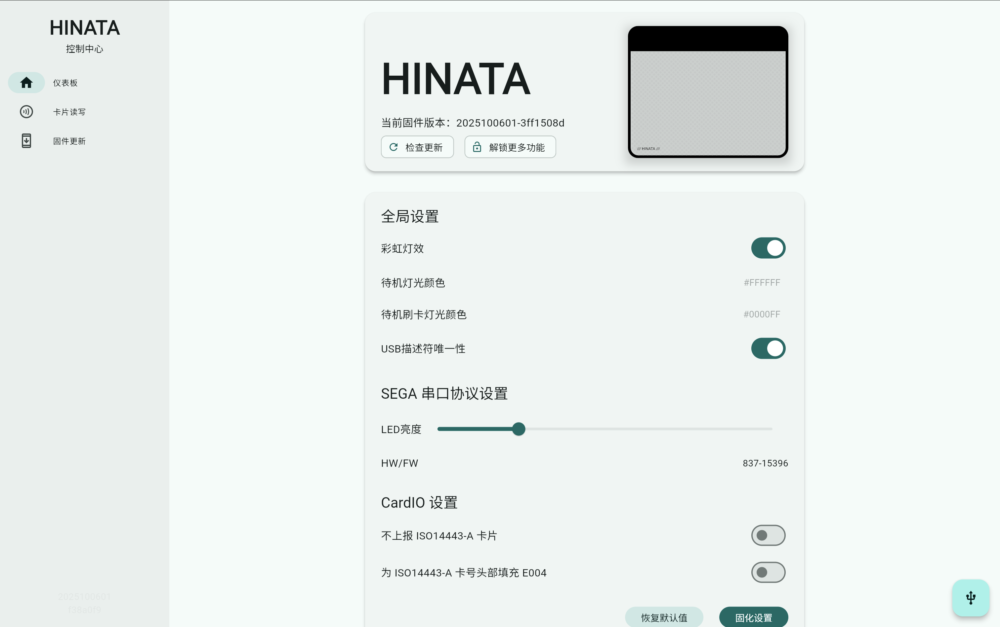

# HINATA 控制中心

## 简介
HINATA 控制中心用于控制 HINATA 的各项设置以及写卡用（Coming Soon）。所以现阶段只能更新固件用。

无需本地下载，只需要联网并访问 [cc.neri.moe](https://cc.neri.moe) 即可使用！

## 连接
点击**连接**按钮或右下角按钮，浏览器会弹出如下窗口（以 Chrome 为例）：

请**点击 HINATA** 后再**点击连接按钮**

## 侧边栏选项

### 仪表板
仪表板上会显示当前读卡器的固件版本号以及调整设置

### 卡片读写
出现以下界面后请放置需要读写的卡片在读卡器上

放置卡片后出现以下界面，写卡请输入 **20 位 Access Code** 到输入框内并**回车**以刷入卡号，如果没有卡号输入的对话框说明卡片不支持写入

### 固件更新
**当前版本不支持 Windows 使用控制中心进行固件更新，请下载固件后手动更新**
**如果您使用 MacOS 或者 Linux, ChromeOS 等系统，则可以在网页内直接更新**

点击卡片右下角**安装更新**按钮进行固件更新

