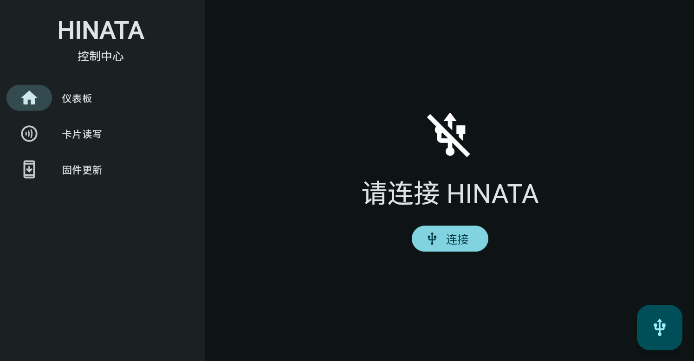
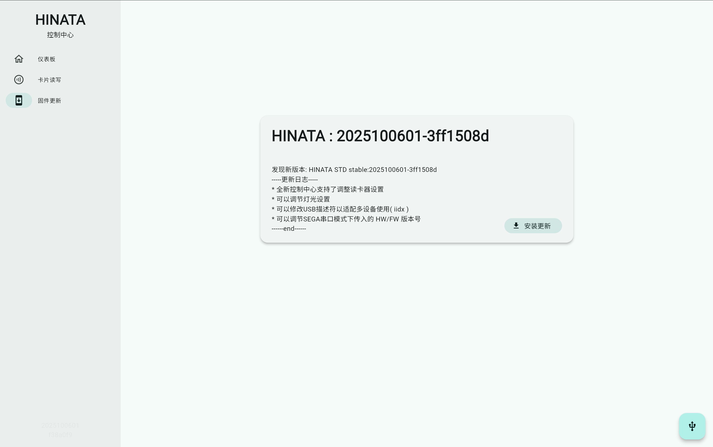

# HINATA 控制中心

## 简介

HINATA 控制中心用于管理 **HINATA / HINATA Lite** 的各项设置，并提供卡片读写等功能。

无需本地下载安装，只需在**联网状态**下通过浏览器访问  
[cc.neri.moe](https://cc.neri.moe)  
即可直接使用。

## 连接读卡器

点击页面中的 **连接** 按钮，或右下角的快捷按钮后，浏览器会弹出设备选择窗口（以 Chrome 为例）：

请在列表中**选择 HINATA**，然后点击 **连接**。

## 侧边栏功能说明

### 仪表板

仪表板页面用于显示当前读卡器的 **固件版本号**，并提供当前读卡器的设置选项。

### 卡片读写

进入卡片读写页面后，请将需要操作的卡片放置在读卡器上：

识别到卡片后会显示如下界面：

- 写卡时，请在输入框中输入 **20 位 Access Code**
- 输入完成后按 **回车键** 即可写入卡号
- 如果界面中**没有出现输入卡号的输入框**，则说明该卡片 **不支持写入**

### 固件更新

::: warning
当前版本 **不支持在 Windows 系统下** 通过控制中心直接进行固件更新。  
请下载固件文件后，按照文档说明手动更新。
:::

::: tip
如果你使用的是 **macOS / Linux / ChromeOS** 等系统，  
可以直接在网页内完成固件更新。
:::

点击卡片右下角的 **安装更新** 按钮，即可开始固件更新流程。
