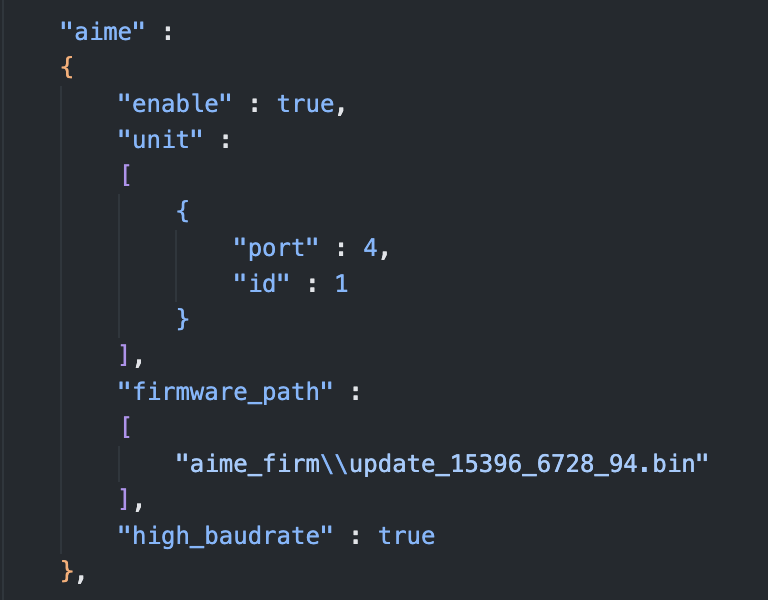

# 修改游戏所需的端口号

**如果你没有 中二节奏 和 舞萌/音击 来回换着玩的需求，也没有什么特殊需求的话可以忽略本节**

本文仅限对于使用官方串口协议连接的用户使用，如果您按照下面的教程修改了部分配置文件，但要使用 `虚拟读卡(回车)` 或者 `aimeio`，请将配置文件还原回默认配置，否则无法使用。

## 简介
   | 游戏 | 默认端口号 |
   | :---: | :---: |
   |maimai DX | COM1 |
   |ONGEKI | COM1 |
   |CHUNITHM | COM4 |

以上是击中萌三款游戏的默认端口号，但**并不是固定**的，用户可以通过修改配置文件来修改游戏所需要的端口号。

设想一个需求，你只有一台电脑，一台读卡器，但是想玩多个游戏。音击和舞萌因为游戏端口号相同，所以默认情况下可以只用设置一次就可以开玩。但中二节奏因为读卡器端口号和其他游戏不同，所以诞生了本节教程。

目前大部分SEGA游戏都使用了 `amdaemon` ，读卡器相关的设置是由 `amdaemon` 所控制，玩家可以在传入 `amdaemon` 的配置文件中修改游戏所需的读卡器端口号。

## 文件修改
### 文件介绍
以下是一个正常的游戏文件中会出现的所有 `amdaemon` 的配置文件：

* `config_client.json` 和 `config_server.json` 均为配信服务器相关设置，本文可以忽略
* `config_hook.json` 为segatools自带的，用于强制覆写部分设置
* `config_cvt.json` 和 `config_sp.json` 是 **Chunithm** 独有的配置文件
* `config_common.json` 是所有游戏都会有的配置文件

我们要找的端口号设置就存放在 `config_common.json`，但是如果是 **Chunithm** 的话则需要编辑 `config_cvt.json` 和 `config_sp.json` 根据启动时使用的框体不同而不同

### 修改
打开 `config_common.json` 或者 `config_cvt/sp.json`，往下翻就可以找到 `aime` 条目：

`"port": 4` 后面的 `4` 就是我们要修改的地方，我们可以将它修改为其他的并且不与 **官方使用的其他端口号** 相同的端口号。

### 何为 "官方使用的其他端口号" ？

例如 **Chunithm** 中，SEGA官方使用了 `COM1` 来连接 *Ground Slider*（地键触摸板），那么修改读卡器端口号时就不可以使用 `COM1`

以下是常见游戏的 官方使用的端口号（排除读卡器）：

* maimai DX : `COM2: VFD屏幕`, `COM3 & COM4: 1P & 2P 触摸屏`, `COM21 & COM23: 灯板`
* chunithm SP模式: `COM1: 触摸板`, `COM2: VFD屏幕`, `COM20 & COM21: 灯板`
* chunithm CVT模式: `COM1: 触摸板`, `COM2 & COM3: 灯板`
* ongeki: `COM2: VFD屏幕`, `COM3: 灯板`

以上端口号均无法用于读卡器端口。

## 用例

我只有一台读卡器和一台电脑，但是我想要中二节奏和舞萌之间来回换着玩。
那么可以
1. 编辑舞萌的 `config_common.json`，将读卡器端口号改为 `COM7` 
2. 打开中二节奏的 `config_cvt/sp.json`，将读卡器端口号也改为 `COM7` 。
3. 最后进入设备管理器将读卡器实际端口号也改为 `COM7`，并重新插拔

这样就可以做到两个游戏之间切换时不需要切换读卡器端口号了