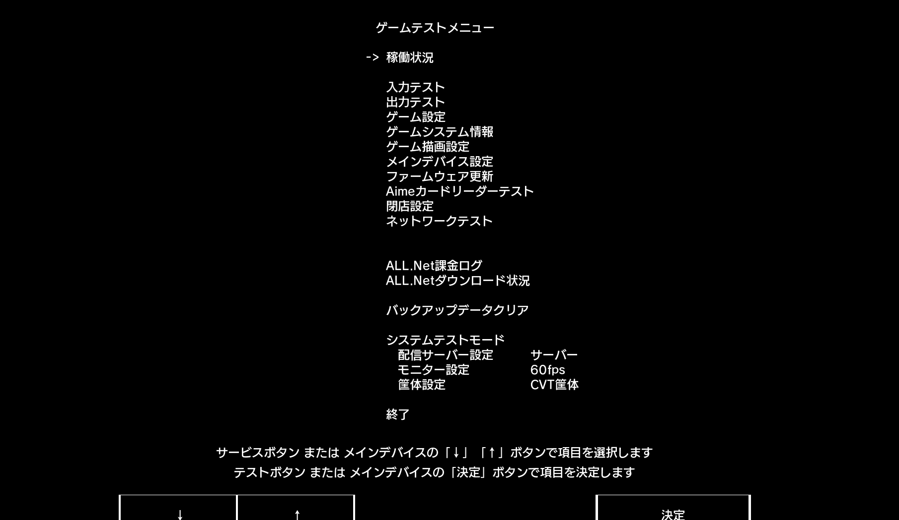

# 游戏内测试读卡器

1. 进入对应游戏的 *测试模式（TEST）*  
   

2. 根据不同游戏的操作方式，选择 `Aimeカードリーダーテスト`  
   

3. 进入后可以进行 **读卡测试** 以及 **LED 测试**

::: tip
在关闭 Segatools 的 Aime hook 后，  
如果在该测试界面中 **上方两行软 / 硬件版本号均未显示任何内容**，  
则表示游戏 **没有成功连接到读卡器**。
:::

## 其他页面
- [串口方式连接游戏](serial.md)
- [AimeIO 方式连接游戏](aimeio.md)
- [KONAMI 游戏设置](../KONAMI/index.md)
