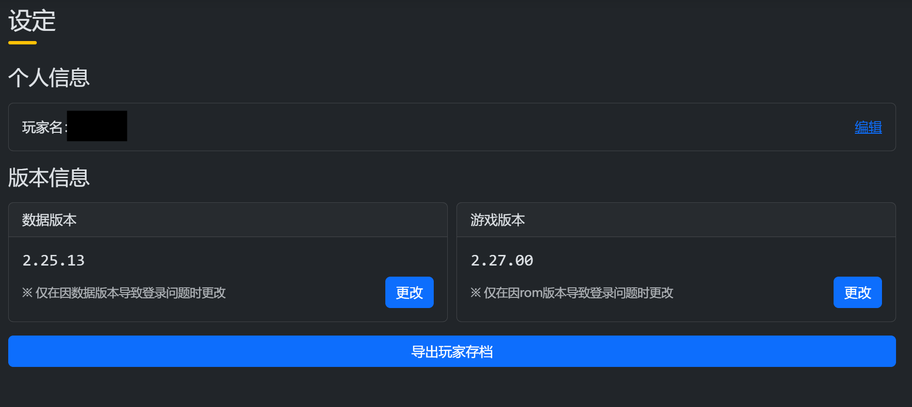
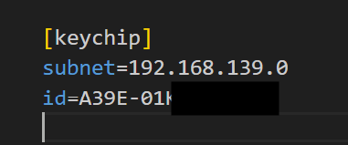
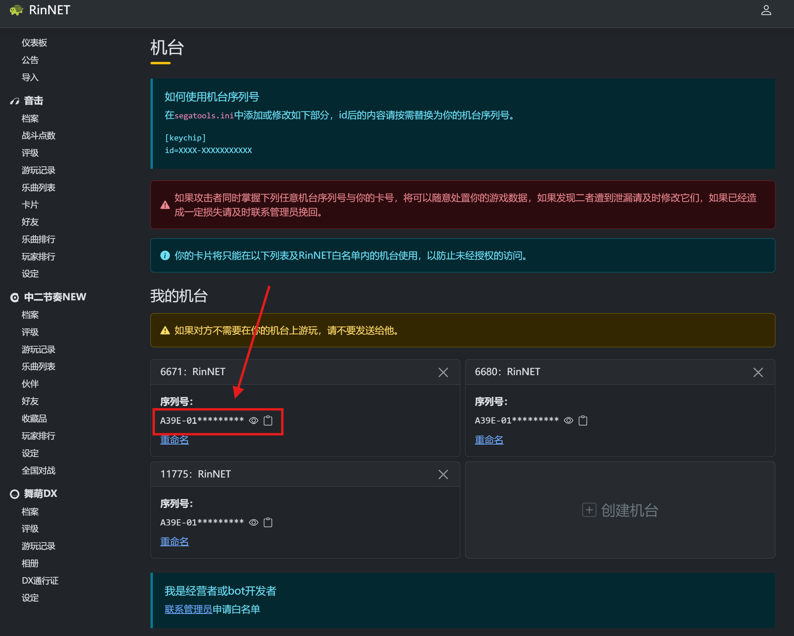

# 常见问题（SEGA）

## Q: 为什么我在使用读卡器之前游戏能联网，但使用后就无法联网？
**A:**  
在关闭 Segatools 的模拟读卡器（Aime hook）后，如果游戏未能检测到真实读卡器，游戏会直接判定为异常并断网。  
请检查读卡器是否正确连接，以及端口、模式等配置是否正确。

## Q: 我确认读卡器已连接（灯光可正常控制），但是无法刷卡？
**A:**  
请检查读卡器是否紧贴在 ADX 面板表面，或底部是否接触到金属。  
如果存在上述情况，请使用**非金属材料**将读卡器垫高，或将其移动到其他位置后再尝试。

## Q: 官方卡在游戏里刷出来的卡号（0008 开头）和卡背面印的不一样？
**A:**  
在使用 **SEGA 官方串口协议** 时，刷 `Amusement IC` 卡片得到的卡号取决于服务器是否正确实现了 AimeDB。

- 官服或正确实现 AimeDB 的服务器（如 Rin 服）可正常获取卡号  
- 未正确接入 AimeDB 的服务器会返回 `0008` 开头的错误卡号

解决方案：
- 更换服务器  
- 或改用 **新版 AimeIO 连接方式**

## Q: 读卡器功能太少 / 有 Bug 怎么办？
**A:**  
功能性建议或 Bug 反馈请直接在售后群或私聊我提出。  
确认属于软件问题后，会尽快进行修复。

## Q: 刷不上卡怎么办？
**A:**  
请根据游戏内提示信息进行排查：

### 1. `筐体のデータが古いバージョンです`

请确认自己是否曾游玩过**更高版本**的游戏。  
也可以进入服务器仪表板界面查看（以下以 Rin 服为例）：

请确保游戏版本与服务器配置一致，必要时可将版本号修改为对应版本或更低。

### 2. `このモードでは本バージョンのプレイデータが存在しない Aime は使用できません`

请确认是否开启了 **大会模式**。  
在大会模式下无法注册新账号。

以 SDHD（CHUNITHM NEW 以后版本）为例：

请将 **イベントモード** 修改为 **通常モード**。

### 3. `通信に失敗しました`

请确认以下内容：

- 游戏是否已正确联网  
- KeychipID 是否填写正确  

KeychipID 的获取方式请查看所使用服务器的仪表板页面，以下以 Rin 服为例：

此外，还需确认**所使用的卡片类型与连接方式**是否匹配。

::: tip
大部分兼容卡在使用 **官服 AimeDB** 时无法刷卡。  
如果你在使用 **AimeIO 连接方式** 时无法刷卡，请参考：  
[AimeIO 食用须知](aimeio.md#食用须知)
:::
