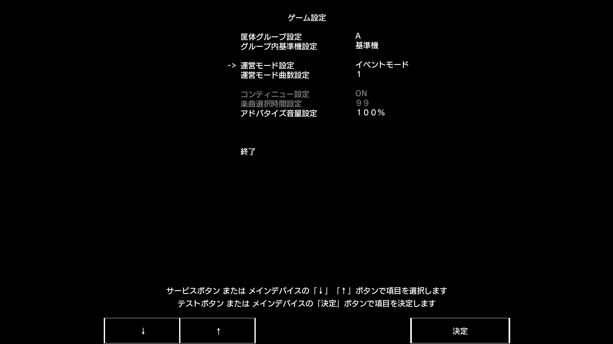

# 常见问题 ( SEGA )
---

**Q: 为什么我在使用读卡器之前游戏能联网，但使用后就无法联网**  
**A:** 在关闭了 Segatools 的模拟读卡器以后，游戏如果没有检测到读卡器时就会直接断网，所以请检查一下读卡器的连接与配置是否正确

---

**Q: 我确认读卡器已连接（灯光正常被控），但是无法刷卡**  
**A:** 是不是贴在 ADX 的表面上了，或者读卡器底部有金属，是的话请用非金属材料垫高或者放到别处

---

**Q: 官方卡在游戏里刷出来的卡号（0008 开头）和背面印的不一样**  
**A:** 如果使用官方协议，刷 `Amusement IC` 卡片时刷到的卡号将会取决于服务器，如果 AimeDB 服务器正确实现了就可以刷得出（Rin 服，官服 AimeDB）。解决方案是更换服务器，或者使用 **新版 AimeIO**。

---

**Q: 读卡器功能太少 / 有 Bug 怎么办**  
**A:** 功能性建议或者出现 Bug 请直接在售后群或者私聊我提出，软件 Bug 会在核实后尽快修复

---

**Q: 刷不上卡怎么办**  
**A:** 请关注游戏提示信息：
1. **筐体のデータが古いバージョンです**：  

    请确认自己有没有在之前有玩过更高版本的游戏，也可进入服务器仪表板界面查看（如 Rin 服）：

    

    请确定游戏版本是否对应，也可修改版本号到对应游戏版本或更低。

2. **このモードでは本バージョンのプレイデータが存在しない Aime は使用できません**：  

    请确认自己是否开启了大会模式，大会模式下无法注册新账号。  
    以 SDHD(CHUNITHM NEW 以后)为例：

    

    请将此处的**イベントモード**改为**通常モード**。

3. **通信に失敗しました**：  

    请确认自己正确联网并且正确填写 KeychipID：

    

    KeychipID 的获取及使用请自行进入服务器仪表板界面查看，此处以 Rin 服为例：  

    

    其余请查看**自己使用的卡片和连接方式**：  
    ::: tip
    大部分兼容卡无法在使用 **官服 AimeDB** 时刷卡。  
    [AimeIO 连接方式无法刷卡请见](aimeio.md#食用须知)
    :::

---