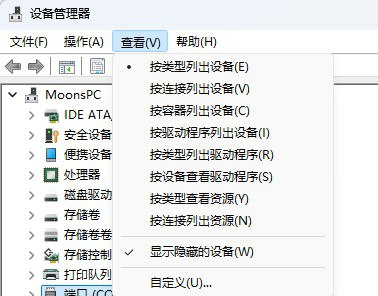
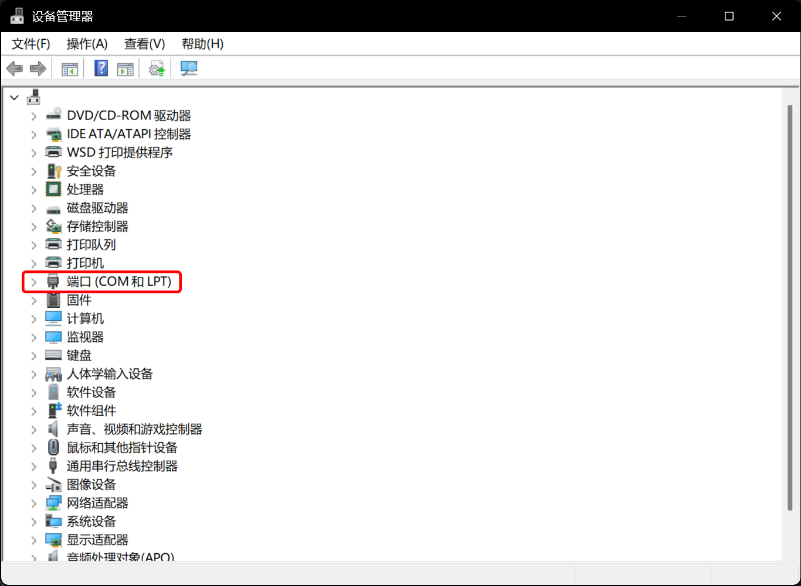
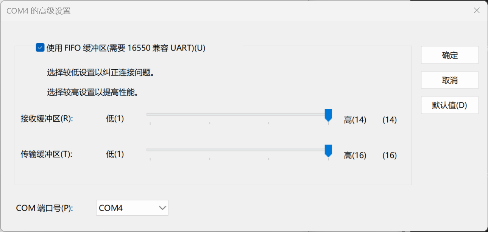

# SEGA 官方串口协议连接游戏

::: tip 食用须知
使用 SEGA 官方串口读卡器协议时，需要关闭 Segatools 的读卡器 hook。

如果在关闭 hook 后，游戏未能成功连接读卡器（例如端口号配置错误），游戏将会直接断网。
请在确认配置无误后重新启动游戏。
:::

## 读卡器端口配置

| 游戏 | 默认端口号 |
| :--: | :--------: |
| maimai DX | COM1 |
| ONGEKI | COM1 |
| CHUNITHM | COM4 |

### 端口确认与释放

1. 首先确认你所游玩的游戏使用的 **串口端口号**，并记下该值。  
   上表为常见游戏的默认端口号。

   其他游戏如果使用了 AMDaemon，可在 `config_common.json` 中查看或修改端口号：  
   [查看或修改串口端口号](com_port.md)

2. 打开 Windows 的 **设备管理器**，保持默认的“按类型列出设备”视图，并勾选  
   **查看 → 显示隐藏的设备**

   

3. **拔掉读卡器**，查看是否存在 `端口 (COM 和 LPT)` 分类

   

   - 如果没有该分类，可直接跳到下一节  
   - 如果存在，请展开并检查目标端口号是否已被其他设备占用

4. 若端口被占用，右键该设备并依次进入  
   **属性 → 端口设置 → 高级**

   

5. 将该设备的 `COM 端口号` 修改为其他不常用的端口（例如 COM255）

### 设置读卡器端口号

6. **插入读卡器**，将设备管理器切换为 **按容器列出设备**

   

7. 找到 **HINATA**

   

8. 右键 `USB 串行设备`，依次进入  
   **属性 → 端口设置 → 高级**

9. 将 `COM 端口号` 修改为对应游戏所需的端口号。  
   由于读卡器使用 *USB CDC* 类进行串口通信，通常 **无需修改波特率**。

10. 修改完成后，建议切换回 **按类型列出设备**，再次确认：
    - 读卡器端口未与其他设备冲突

11. **修改完成后请务必重新插拔一次读卡器**。  
    若为首次配置，建议重启一次电脑；  
    或在设备管理器中将 `USB 串行设备` 禁用后再启用。

## 游戏本体配置

::: tip
请确保游戏已经能够正常联网。  
进入游戏后应显示 **绿色地球图标**，否则请先完成联网配置（不在本文讨论范围内）。
:::

1. 打开 `segatools.ini`，并按以下方式修改配置：

   ```ini
   ; 如果没有 [aime] 条目，请手动添加
   [aime]
   enable=0
   ; enable=0 用于关闭 Segatools 的读卡器 hook
   ; 使用官方串口 IO 时必须这样设置

   ; 如果存在 [aimeio] 条目（例如使用过 HINATA 的 AimeIO 模式，
   ; 或 mageki / nageki 等），请将其注释或直接删除
   ;[aimeio]
   ;path=hinata.dll


2. 由于读卡器使用 *USB CDC* 类进行串口通信，通常 **无需修改波特率设置**

3. 启动游戏

## 其他页面

* [调整串口模式下灯光亮度](../HCC/index.md)
* [AimeIO 方式连接 SEGA 游戏](aimeio.md)
* [游戏内测试读卡器](in_game_test.md)
* [KONAMI 游戏设置](../KONAMI/index.md)
