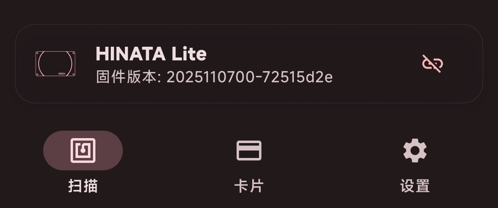
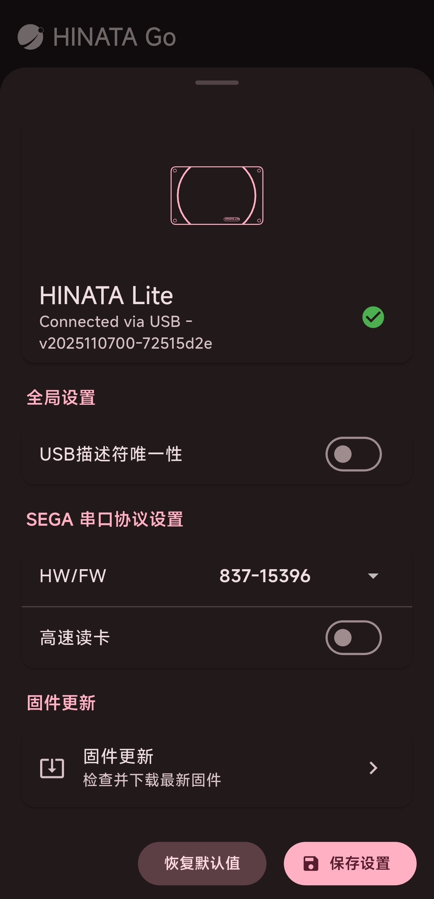

# 管理 HINATA 读卡器

如果你需要修改读卡器设置、查看设备状态或更新固件，请从这里开始。

大多数读卡器管理操作会通过 **HINATA Go** 完成。HINATA Go 本身是一款用于读卡、卡片管理和远程刷卡的应用；当它运行在支持连接实体读卡器的平台上时，也可以直接连接 HINATA 读卡器并修改设备设置。

在 Windows 上，读卡器设置仍可通过 HINATA Go 网页版修改；但固件更新需要使用 **HINATA Client**。

## 你可以做什么

- 查看读卡器连接状态与固件版本
- 修改读卡器设置，例如工作模式、读卡限制等
- 更新读卡器固件，获得新功能与稳定性改进
- 在接入游戏或第三方生态前，确认读卡器是否正常工作

## 应该使用哪个工具？

如果你只是想修改读卡器设置或查看设备状态，请使用 **HINATA Go 网页版** 或 **Android 版 HINATA Go**。

- Windows / macOS / Linux / ChromeOS 可以使用 HINATA Go 网页版
- Android 可以使用 HINATA Go App

如果你想更新固件，需要根据当前设备选择方式：

- Android / macOS / Linux / ChromeOS 可以使用 HINATA Go 更新
- Windows 需要使用 HINATA Client 更新

如果你只是使用读卡器刷卡游玩游戏，通常不需要每次都打开这些工具；在首次使用、修改设置、更新固件或排查问题时再打开即可。

## 使用 HINATA Go 连接读卡器

### 网页版

<Links
  :items="[
    {
      name: 'HINATA Go',
      link: 'https://go.neri.moe',
      linkText: '点击访问'
    }
  ]"
/>

### Android 版

<Links
  :items="[
    {
      name: 'HINATA Go Android',
      link: 'https://github.com/nerimoe/hinata_go/releases',
      linkText: 'APK 下载'
    }
  ]"
/>

## 连接读卡器

使用一根数据线将当前设备与 HINATA 读卡器相连接，使 HINATA Go 可访问 HINATA 读卡器。

## 进入读卡器详情

连接完成后，可点击屏幕下方此栏进入详细界面：

详细界面如下，可在这里修改设置、更新固件或查看 HINATA 读卡器状态

## 使用 HINATA Client 更新固件

如果你使用的是 Windows，请参考 [固件更新](/update/) 页面，通过 HINATA Client 更新读卡器固件。
