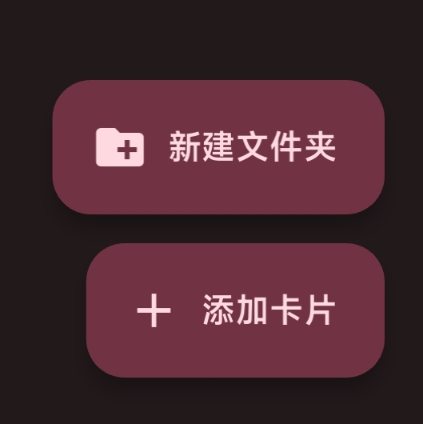

# 卡片管理

切换到 **卡片** 栏目，即可管理卡片

## 文件夹

默认拥有 1 个文件夹：收藏  
以及 **历史**  
**收藏** 是应用的默认文件夹，可以保存卡片或添加卡片使用  
**历史** 会保存曾经刷过的卡供使用、

### 添加卡片

点击右下角下方的 **添加卡片** 按钮进入手动添加卡片界面

Access Code 必须为 **非 3 开头的 20 位数字**