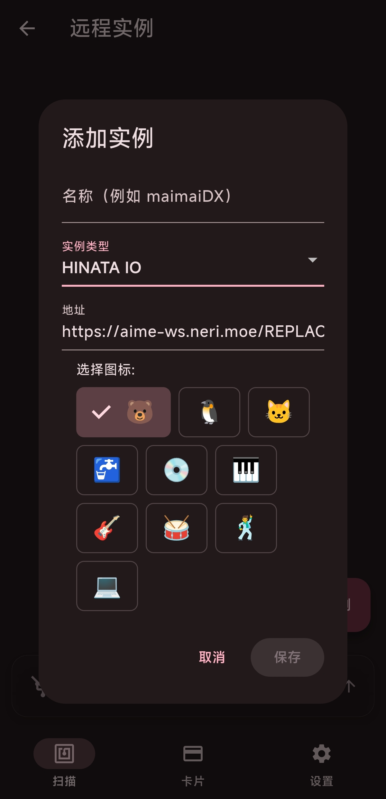
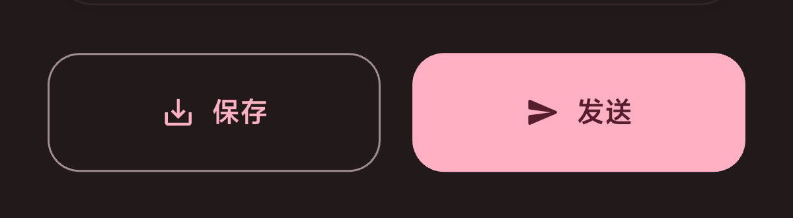
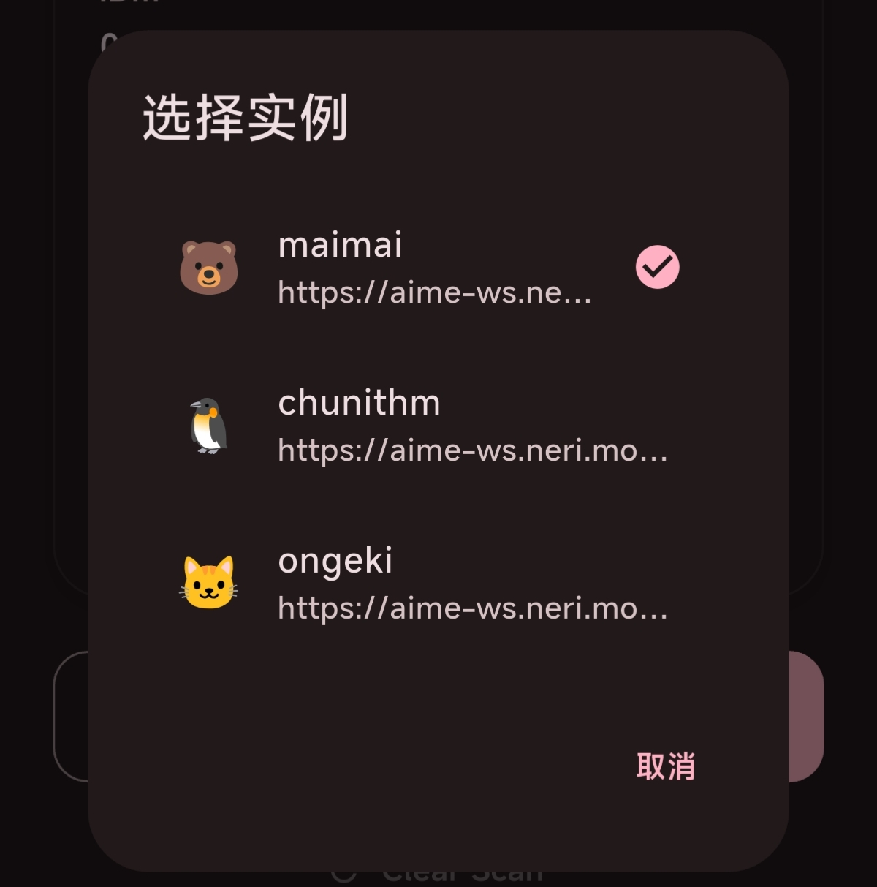
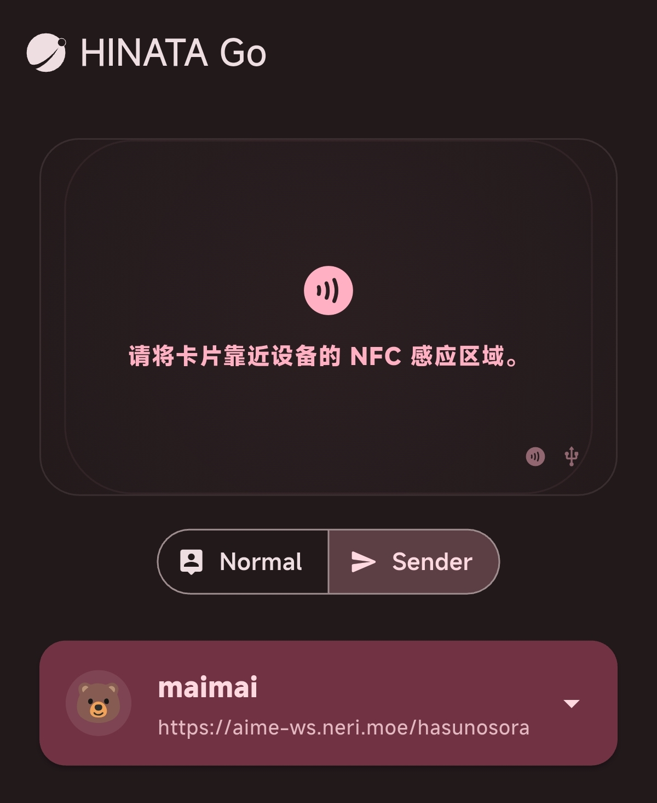

# 连接游戏作为读卡器

## SEGA 游戏配置

> **以下配置均以 HINATA 公共刷卡服务器 ( `aime-ws.neri.moe` ) 为例，请确保你的网络环境可以正常访问 Cloudflare 的服务**

### 配置 Segatools

1. 首先在你的游戏部署 [HINATA AimeIO](/game-setting/sega/hinata-client/) ，然后配置远程刷卡服务器，使用文本直接编辑或使用 HINATA Client 图形化编辑均可
    ```ini
    [aime]
    enable=1

    [aimeio]
    path=hinata.dll
    serverUrl=wss://aime-ws.neri.moe/REPLACEME
    ```
    

    **将 `REPLACEME` 替换为你自定义的一串英文字符串，并确保够唯一，否则可能会和他人重复**
2. [下载最新版本的 HINATA Go](/go/index.md#下载)，安装并打开
3. 在软件内添加一个 Instance，名称自定义，URL 则配置为 `https://aime-ws.neri.moe/REPLACEME`，如图所示：

4. 打开游戏开始玩？！

## KONAMI 游戏配置

### SpiceAPI
> **⚠️ 目前尚未搭建SpiceAPI的转发服，所以只能局域网使用，当然你也可以使用cloudflared自行转发**
1. 打开 `spicecfg.exe`
2. 找到 spiceapi 的配置项，设置port，密码留空
3. 在 HINATA Go 内添加一个Instance，URL配置为 `你电脑IP:Spice监听端口`，例如 `192.168.0.114:1145`，不需要带 `http://`

## 发送 刷卡

### Normal 模式

在刷卡后，往下滑有两个按钮，点击右边的发送按钮并选择实例即可刷卡





### Sender 模式

请先选择实例后使用设备的 NFC 进行刷卡，刷卡后自动发送

