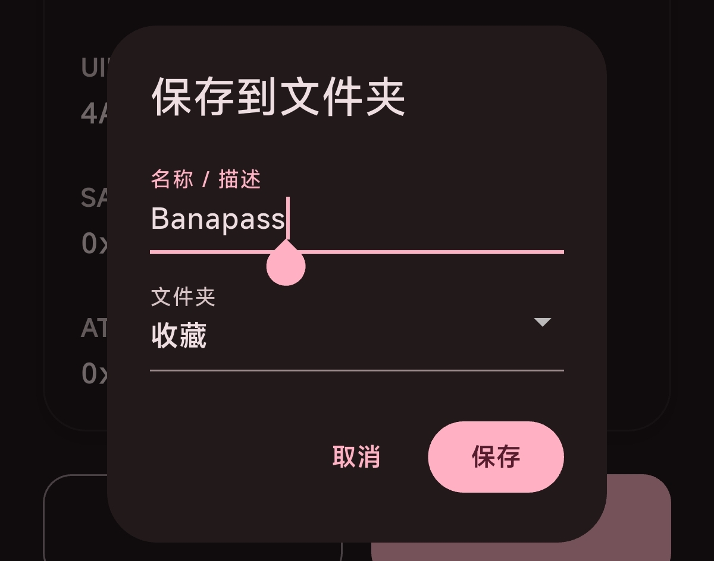
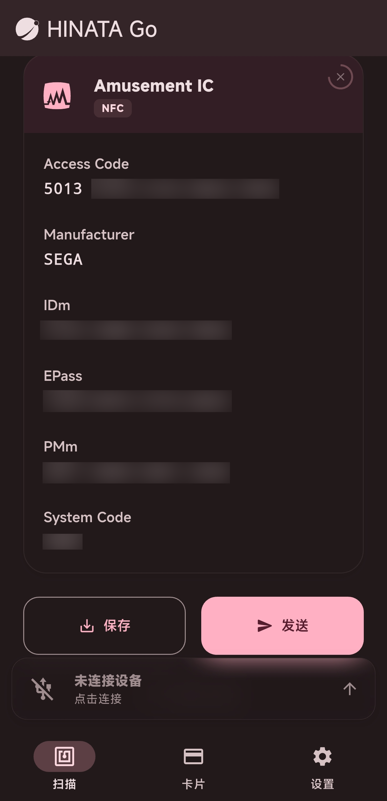
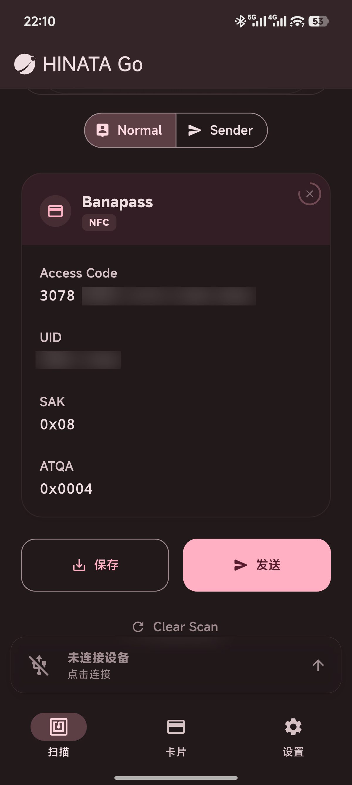

# 读取卡片信息

## 可读取卡片类型

* [**Amusement IC**](#amusement-ic)
* [**旧版 Aime**](#旧版-aime-大部分兼容卡)
* [**Bandai Namco Passport**](#bandai-namco-passport-bana-passport)
* **E-Amusement Pass**
* **FeliCa**

## 如何读取

将卡片置于移动设备 NFC 识别区域，即可读取卡片信息，如：

或连接 HINATA 读卡器进行识别，如：

## 保存卡片

在刷卡后，往下滑有两个按钮，点击左边的保存按钮并自定义名称和文件夹即可保存

## 读取信息

### Amusement IC

### 旧版 Aime / 大部分兼容卡

### Bandai Namco Passport / BANA PASSPORT

