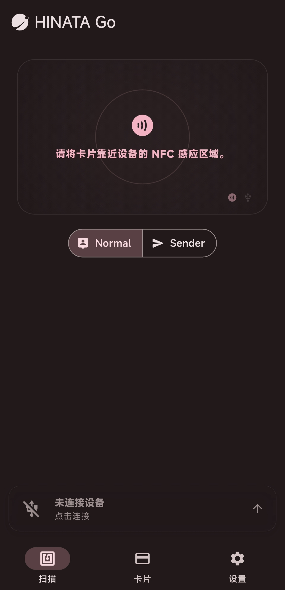

# HINATA Go 

<Links
  :items="[
    {
      name: 'HINATA Go Repository',
      link: 'https://github.com/Project-HINATA/hinata_go',
      linkText: '点击访问'
    }
  ]"
/>

## HINATA Go 是什么？

HINATA Go 是一款移动应用程序，可将您的手机变身为多功能街机游戏刷卡器。它配合 HINATA AimeIO 服务使用，支持多种类型的游戏卡片读取（如 Amusement IC、旧版 Aime、Bandai Namco Passport 等），并能通过 NFC 或连接 HINATA 读卡器进行刷卡操作。该应用允许用户将手机连接到 SEGA 或 KONAMI 等街机游戏，作为远程读卡器使用，同时也提供卡片管理功能，方便用户保存、分类和使用卡片。HINATA Go 支持多平台，旨在为街机游戏爱好者提供便捷的卡片管理和游戏体验。

HINATA Go 也可以连接 HINATA 读卡器进行 [HINATA 读卡器的配置与固件更新](features/hinata-card-reader)。

## 网页版

<Links
  :items="[
    {
      name: 'HINATA Go',
      link: 'https://go.neri.moe',
      linkText: '点击访问'
    }
  ]"
/>

## 下载

| iOS | Android |
| --- | ------- |
|  | [**APK 下载**](https://github.com/nerimoe/hinata_go/releases) |

## 界面

如图所示，当我们安装完成后打开应用应是这样的 UI 界面

## 功能

<Links
  :items="[
    {
      name: '读取卡片信息',
      link: 'features/read-card-info',
    }
  ]"
/>
<Links
  :items="[
    {
      name: '连接游戏作为读卡器',
      link: 'features/game-connection',
    }
  ]"
/>
<Links
  :items="[
    {
      name: 'HINATA 读卡器配置 & 更新',
      link: '/configuration',
    }
  ]"
/>
<Links
  :items="[
    {
      name: '卡片管理',
      link: 'features/cards',
    }
  ]"
/>