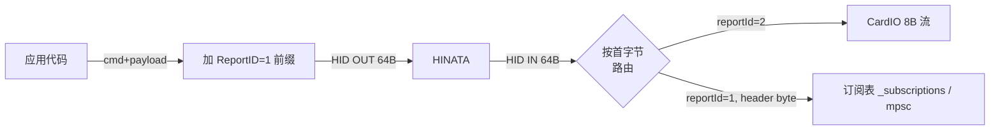
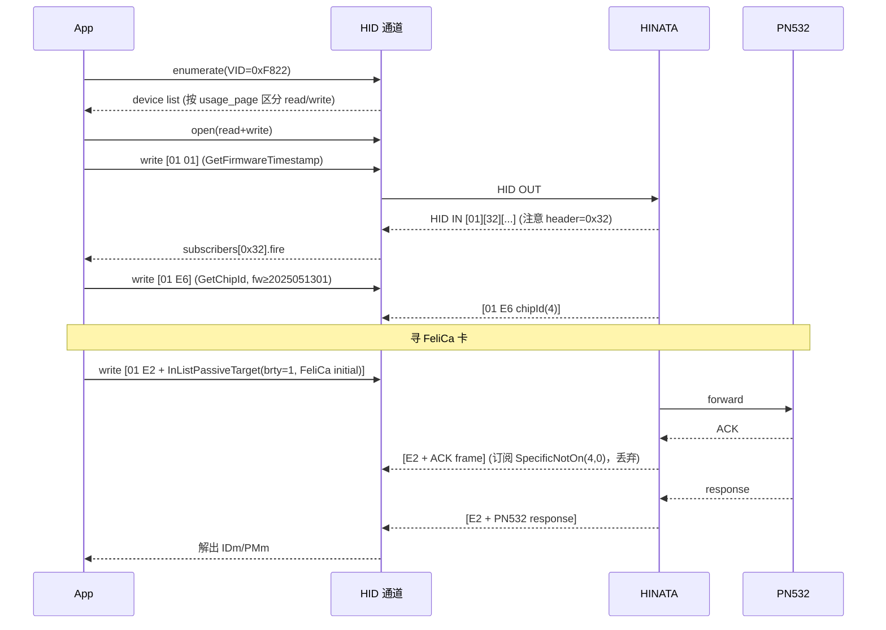

# HID 通信协议

> 本页描述 HINATA 读卡器的 HID 层通信协议、设备发现、帧结构、命令字与订阅/分发模型，适用于希望自行实现上位机或对接的开发者。

参考实现：

- [hinata-rs](https://github.com/Project-HINATA/hinata-rs) — 桌面端 Rust，基于 hidapi。
- [hinata_go](https://github.com/nerimoe/hinata_go) — Flutter，桥接 WebHID（桌面/Web）与 Android `quick_usb`。

两套实现的协议层完全一致，差异仅在底层 HID 通道的封装。

---

## 1. 设备识别

| 字段 | 值 |
|---|---|
| **Vendor ID (VID)** | `0xF822`（十进制 `63522`） |
| **Product ID (PID)** | 不固定（设备返回，作为机种标识） |
| **Manufacturer 字串** | `NERI`（Linux udev 规则用此匹配） |
| **HID Report Size** | 64 字节 |
| **HID Report ID（写）** | `0x01` |
| **HID Report ID（CardIO 输入）** | `0x02`（仅 8 字节，特殊用途） |

### 1.1 平台特定查找逻辑

| 平台 | 查找 / 匹配方式 | 端点结构 |
|---|---|---|
| **Windows / Linux** | hidapi 枚举 VID=`0xF822`，按 `usage_page` 区分 | **双接口**：`usage_page == 0x01` → **READ**，`usage_page == 0x06` → **WRITE** |
| **macOS** | hidapi 枚举 VID=`0xF822`，仅取 `usage_page == 0x06` | **单接口**（读写共用） |
| **Android** | `quick_usb` 枚举 VID=`0xF822`，扫描所有 interface（跳过 class `2` CDC、class `10` CDC-Data），claim 后按端点 direction 分 IN/OUT | Bulk IN + Bulk OUT 端点 |
| **Web** | `navigator.hid` (`neo_web_hid`)，filter `{ vendorId: 0xF822 }` | 浏览器 WebHID API |

Windows 设备 instance‑id 通过把 hidapi 路径按 `#` 切分得到（用于配对同一设备的 read/write 两个接口）。Windows 还会通过 SetupAPI / `CM_Get_Parent` 向上爬，再 `CM_Get_Child` 找出兄弟节点中 ClassGuid 为 `Ports` 的串口（用于映射出对应的 `COMx`）。

### 1.2 Linux udev 规则

```
ATTRS{manufacturer}=="NERI", MODE="0666"
```

### 1.3 Android USB filter

```xml
<usb-device vendor-id="63522" />   <!-- 0xF822 -->
```

---

## 2. HID I/O 模型



### 2.1 写入帧（Host → Reader）

```
[ReportID=0x01] [CMD] [PAYLOAD ...]   总长度 ≤ 64
```

- hidapi/WebHID：`device.write([0x01, cmd, ...payload])` 或 `sendReport(1, payload_with_cmd_at_offset_0)`
- Android Bulk OUT：`bulkTransferOut(write_ep, [0x01, cmd, ...payload])`

### 2.2 读取帧（Reader → Host）

64 字节 HID input report，**首字节 = ReportID**：

| ReportID | 含义 | 解析 |
|---|---|---|
| `0x01` | 普通命令响应 | `data[1]` = response header（一般等于发送的 CMD，特例见下），`data[2..]` = payload |
| `0x02` | CardIO 输入 | 8 字节卡号数据，独立的回调流 |

**特例**：发送 `CMD=0x01`（GetFirmwareTimestamp）时，**响应 header = `0x32`**。

```rust
// builder.rs
if data[1] == 1 { 50 } else { data[1] }
```

```dart
// hinata_device.dart
if (command == 1) responseHeader = 0x32;
```

参考：[`builder.rs`](https://github.com/Project-HINATA/hinata-rs/blob/main/src/builder.rs)、[`hinata_device.dart`](https://github.com/nerimoe/hinata_go/blob/main/lib/services/hardware/core/hinata_device.dart)。

### 2.3 为什么需要订阅机制

HINATA 主协议（`0x01` ReportID 通道）**没有任何包级别的序列号 / 事务 ID / 关联字段**——不像 Sega 协议里 `SEQ` 字节那样能把「应答」一对一绑回「请求」。一帧响应里能用来区分「这是谁的回复」的，**只有首字节那个 header（≈ 原始 CMD）**。这带来几个必须处理的问题：

1. **并发请求会撞车**：若同时发出两条 `GetConfig(0xD4)`，两条响应都是 header `0xD4`，无法靠协议字段区分先后，必须由上层串行化。
2. **异步推送与同步应答混在同一通道**：固件会主动推送（订阅式数据，例如 PN532 透传中的 ACK + 真正响应、CardIO 流），不是所有 IN 帧都是「上一条 OUT 的应答」。
3. **存在多帧响应 / 中间帧需要丢弃**（典型：PN532 先回 ACK `00 00 FF 00 FF 00`，再回真正的数据帧）——简单的「发一条收一条」模型会拿到错误的帧。
4. **响应 header 不总等于请求 CMD**：`CMD=0x01` 的回复 header 是 `0x32`，需要在订阅时显式声明期望的 header。

两套参考实现采用相同思路：**按 header 字节路由 + 每个订阅自带「何时摘除」策略**。这等效于在缺少协议层 SEQ 的情况下，在主机侧软件层补出一个事务管理器。对比如下：

| 维度 | Sega 协议（`0xE0`） | HINATA 主协议（其他 CMD） |
|---|---|---|
| 包内有 `SEQ` 序号 | ✅ 每包 +1，可精确配对 | ❌ 无 |
| 应答与请求关系 | 由 `SEQ` 直接绑定 | 仅靠 header 字节匹配 |
| 多帧 / ACK 帧处理 | 协议本身极少出现 | 必须靠订阅策略过滤 |
| 主动推送数据 | 几乎没有 | 有（CardIO、PN532 异步等） |
| 主机侧实现 | 收一帧即配对完成 | 注册订阅 → 路由 → 按策略摘除 |

换句话说：**订阅机制就是 HINATA 主协议「没有 SEQ」的补丁**——把 header 当成弱关联键，再用 policy 表达「这次事务应在什么条件下结束」（一次、永不、某字节满足/不满足）。

### 2.4 订阅 / 解订阅策略

主线程把 `(header_byte → Subscription)` 注册进一个 map。I/O 线程读到一帧就根据 `data[1]` 派发到对应订阅，用「policy」决定是否摘除：

| 策略 | 触发摘除 |
|---|---|
| `Count(n)` | 收满 n 帧 |
| `Never` | 永不（用于持续流） |
| `SpecificIsOn(idx, byte)` | `data[idx] == byte` 时摘 |
| `SpecificNotOn(idx, byte)` | `data[idx] != byte` 时摘 |

PN532 包装命令使用 `SpecificNotOn(4, 0)`（用于过滤掉 PN532 的 ACK 帧 `00 00 FF 00 FF 00`，等待真正的应答帧）。

---

## 3. 固件层命令包（HINATA 自有协议）

所有命令通过 `[0x01][CMD][PAYLOAD]` HID OUT 发送。下表 CMD 为单字节。

| CMD | 名称 | Payload (Host→Reader) | Response (Reader→Host, `data[2..]`) | 说明 |
|---|---|---|---|---|
| `0x01` | **GetFirmwareTimestamp** | 空 | 10 ASCII 字节，例如 `"2025051301"`，需转 `u32` | 响应 header 为 `0x32` |
| `0x07` | **SetLed** | `[R, G, B]` | 无（fire‑and‑forget） | 立即设置 LED |
| `0xD0` | **SetStorage** | `[index, value]` | 无 | 写持久化存储（NVM/EEPROM） |
| `0xD1` | **GetStorage** | `[index]` | `[value]`（`data[2]`） | 读持久化存储 |
| `0xD3` | **SetConfig** | `[index, value]` | 无 | 写运行时配置 |
| `0xD4` | **GetConfig** | `[index]` | `[value]`（`data[2]`） | 读运行时配置 |
| `0xE0` | **SegaTransport** | Sega 协议帧（见 §5） | Sega 协议帧 | 透传给 Sega 子模块 |
| `0xE2` | **PN532Transport** | PN532 帧（见 §4） | PN532 帧 | 透传给 PN532 |
| `0xE3` | **GetMainLoopState** | 空 | `[state]`（`data[2]`） | 读取固件状态机 |
| `0xE5` | **GetCommitHash** | 空 | 4 字节 commit hash（`data[2..6]`） | 仅固件 ≥ `2025051301` |
| `0xE6` | **GetChipId** | 空 | 4 字节 chip id（`data[2..6]`） | 仅固件 ≥ `2025051301` |
| `0xE8` | **ResetStateMachine** | 空 | 无 | 复位主状态机 |
| `0xE9` | **ReloadConfig** | 空 | 无 | 重新加载存储到运行配置 |
| `0xEA` | **ResetLed** | 空 | 无 | LED 恢复默认 |
| `0xF0` | **EnterBootloader** | 空 | 无 | DFU |

### 3.1 Config / Storage 索引（`ConfigIndex`）

```
0  segaBrightness   1  config0   2  config1
3  idleR  4  idleG  5  idleB
6  busyR  7  busyG  8  busyB
```

`config0` 是位字段：

| bit | 含义 |
|---|---|
| 0 | isFirstLaunch |
| 1 | cardioDisableIso14443a |
| 2 | cardioIso14443aStartWithE004 |
| 3 | enableLedRainbow |
| 4 | serialDescriptorUnique |
| 5 | segaHwFw |
| 6 | segaFastRead |
| 7 | isNotFirstLaunch |

### 3.2 帧示例

```
SetLed(255,0,0):    01 07 FF 00 00
GetFirmware:        01 01           → resp: 02 32 32 30 32 35 30 35 31 33 30 31 ...  ("2025051301", header 0x32)
GetStorage(idleR):  01 D1 03         → resp: 02 D1 <value>
EnterBootloader:    01 F0
```

---

## 4. PN532 透传（CMD = `0xE2`）

HINATA 内置 PN532。把标准 PN532 信息帧整包塞进 payload 即可。

### 4.1 PN532 信息帧

```
00 00 FF  LEN  LCS  TFI CMD [DATA...]  DCS  00
```

- `LEN = len(TFI + CMD + DATA) = data.len() + 2`
- `LCS = (~LEN) + 1`，使 `LEN + LCS == 0`
- `TFI = 0xD4`（Host→PN532）/ `0xD5`（PN532→Host）
- 上行响应 `CMD` 字节会 +1（即 `host_cmd + 1`）
- `DCS = (~Σ(TFI..DATA)) + 1`，使 `Σ + DCS == 0`
- 前后各一字节 preamble/postamble = `0x00`

### 4.2 ACK 帧（要忽略）

```
00 00 FF 00 FF 00
```

PN532 在真正响应之前会先回一个 ACK（`LEN=0, LCS=0xFF`）。订阅策略 `SpecificNotOn(4, 0)` 就是用来跳过 ACK，等待 `data[4] != 0` 的正式应答。

### 4.3 PN532 命令枚举

| CMD | 名称 | CMD | 名称 |
|---|---|---|---|
| `0x00` | Diagnose | `0x46` | InJumpForPsl |
| `0x02` | GetFirmwareVersion | `0x4A` | **InListPassiveTarget** |
| `0x04` | GetGeneralStatus | `0x4E` | InPsl |
| `0x06` | ReadRegister | `0x50` | InAtr |
| `0x08` | WriteRegister | `0x52` | InRelease |
| `0x0C` | ReadGpio | `0x54` | InSelect |
| `0x0E` | WriteGpio | `0x56` | InJumpForDep |
| `0x10` | SetSerialBaudRate | `0x58` | RfRegulationTest |
| `0x12` | SetParameters | `0x60` | InAutoPoll |
| `0x14` | SamConfiguration | `0x86` | TgGetData |
| `0x16` | PowerDown | `0x88` | TgGetInitiatorCommand |
| `0x32` | RfConfiguration | `0x8A` | TgGetTargetStatus |
| `0x40` | **InDataExchange** | `0x8C` | TgInitAsTarget |
| `0x42` | InCommunicateThru | `0x8E` | TgSetData |
| `0x44` | InDeselect | `0x90` | TgResponseToInitiator |
| | | `0x92` | TgSetGeneralBytes |
| | | `0x94` | TgSetMetadata |

### 4.4 常用 PN532 命令载荷

#### InListPassiveTarget (`0x4A`) — 寻卡
- Payload: `[max_tg, brty, initial_data...]`
  - `brty = 0x00` → ISO14443A
  - `brty = 0x01 / 0x02` → FeliCa 212 / 424kbps（`initial_data` 用 `gen_felica_poll_initial_data`）
- FeliCa polling initial data：
  ```
  [0x00, sysCodeHi, sysCodeLo, requestCodeLo, 0x00]
  ```
  典型轮询参数为 `sysCode = 0xFFFF`、`requestCode = 0x0001`，参考 [`pn532.dart::genFelicaPollInitialData`](https://github.com/nerimoe/hinata_go/blob/main/lib/services/hardware/protocols/pn532.dart)。

- 响应解析：
  - `[NbTg, Tg, ...]`
  - **Type A**：`ATQA(2 BE) SAK(1) UID_LEN(1) UID(N)`
  - **FeliCa**：`LEN(1) ResCode(1) IDm(8) PMm(8) [SystemCode(2) ...]`，`SystemCode` 数量 = `(LEN-18)/2`

#### InDataExchange (`0x40`) — 通用 APDU/Mifare/FeliCa 命令
- Payload: `[Tg, CMD, DATA...]`
- 响应首字节为 PN532 错误码（见 §6），后续为数据。

#### Mifare Classic Auth (通过 InDataExchange)
- `CMD = 0x60` (KeyA) 或 `0x61` (KeyB)
- `DATA = [block_num, key(6B), uid(4B)]`

#### Mifare Classic Read (通过 InDataExchange)
- `CMD = 0x30, DATA = [block_num]`
- 响应：`[status, 16B block]`

#### Mifare Classic Write (通过 InDataExchange)
- `CMD = 0xA0, DATA = [block_num, 16B data]`

#### Mifare Ultralight Write
- `CMD = 0xA2`

#### FeliCa Read Without Encryption (通过 InDataExchange)
- `CMD = len(input)+1`（PN532 InDataExchange 的 CMD 字段在此被复用为长度）
- `DATA = [0x06, IDm(8), N_svc, svc[i](2 BE)..., N_blk, blk[i](2 BE)...]`

#### Mifare 命令字
```
AuthA=0x60  AuthB=0x61  Read=0x30  Write=0xA0
Transfer=0xB0  Decrement=0xC0  Increment=0xC1  Store=0xC2
UltralightWrite=0xA2
```

#### FeliCa 命令字
```
Polling=0x00  RequestService=0x02  RequestResponse=0x04
ReadWithoutEncryption=0x06  WriteWithoutEncryption=0x08
RequestSystemCode=0x0C
```

#### InRelease (`0x52`) / InSelect (`0x54`)
- Payload: `[Tg]`，响应首字节 = PN532 错误码。

### 4.5 完整发包示例

获取 PN532 固件版本（`GetFirmwareVersion`）：

```
HID OUT (64B, 多余补零):
  01 E2  00 00 FF 02 FE D4 02 2A 00
  └Hdr  └PN532 frame─────────────────

HID IN (header=E2):
  E2  00 00 FF 00 FF 00                                  ← ACK，订阅器跳过
  E2  00 00 FF 06 FA D5 03 IC VER REV SUP DCS 00         ← 真正响应
```

InListPassiveTarget(brty=0, max=1)：

```
01 E2  00 00 FF 04 FC D4 4A 01 00 E1 00
```

---

## 5. Sega 协议透传（CMD = `0xE0`，仅 Sega 模式机种）

Sega 子板协议封装通过主帧 `0xE0` 透传，订阅策略 `Count(1)`。完整命令解析见 [`sega_protocol.dart`](https://github.com/nerimoe/hinata_go/blob/main/lib/services/hardware/protocols/sega_protocol.dart)；[hinata-rs](https://github.com/Project-HINATA/hinata-rs) 仅提供 raw `0xE0` 通道，不解析包内字段。

### 5.1 帧格式

```
[LEN] [ADDR=0x00] [SEQ] [CMD] [PLEN] [PAYLOAD ...]
LEN = PLEN + 5
```

`SEQ` 是单调递增的包序号（每发一包 +1）。

### 5.2 NFC 命令

| CMD | 名称 | CMD | 名称 |
|---|---|---|---|
| `0x30` | GetFwVersion | `0x60` | ToUpdaterMode |
| `0x32` | GetHwVersion | `0x61` | SendHexData |
| `0x40` | StartPolling | `0x62` | ToNormalMode |
| `0x41` | StopPolling | `0x63` | SendBinDataInit |
| `0x42` | CardDetect | `0x64` | SendBinDataExec |
| `0x43` | CardSelect | `0x70` | FelicaPush |
| `0x44` | CardHalt | `0x71` | NfcThrough |
| `0x50` | MifareKeySetA | `0x80` | ExtBoardLed |
| `0x51` | MifareAuthorizeA | `0x81` | ExtBoardLedRgb |
| `0x52` | MifareRead | `0x82` | ExtBoardLedThinca |
| `0x53` | MifareWrite | `0xF0` | ExtBoardInfo |
| `0x54` | MifareKeySetB | `0xF2` | ExtFirmSum |
| `0x55` | MifareAuthorizeB | `0xF3` | ExtSendHexData |
| | | `0xF4` | ExtToBootMode |
| | | `0xF5` | ExtToNormalMode |

### 5.3 响应码

```
0x00 ok          0x01 cardError       0x02 noAccept
0x03 invalidCmd  0x04 invalidData     0x05 sumError
0x06 asicError   0x07 hexError        0x08 sendFin
0x10 isNewReader 0x20 isNewReader3    0xFF unknown
```

### 5.4 CardDetect 响应解析

```
res[7] = cardNum
若 cardNum == 1:
  res[8] = cardType    0x10 = FeliCa, 0x20 = ISO14443A
  res[9] = idLen
  FeliCa : IDm = res[10..18], PMm = res[18..26]
  ISO14A : UID = res[10..10+idLen]
```

### 5.5 帧示例（StartPolling）

```
05 00 01 40 00
└LEN └ADDR └SEQ=1 └CMD=0x40 (start) └PLEN=0
```

整体打包成 HINATA 主帧：`01 E0 05 00 01 40 00`

---

## 6. PN532 错误码（响应首字节）

```
0x00 None              0x01 Timeout            0x02 CRC
0x03 Parity            0x04 CollisionBitCount  0x05 MifareFraming
0x06 CollisionBitColl  0x07 NoBufs             0x09 RfNoBufs
0x0A ActiveTooSlow     0x0B RfProto            0x0D TooHot
0x0E InternalNoBufs    0x10 Inval              0x12 DepInvalidCmd
0x13 DepBadData        0x14 MifareAuth         0x18 NoSecure
0x19 I2cBusy           0x23 UidChecksum        0x25 DepState
0x26 HciInval          0x27 Context            0x29 Released
0x2A CardSwapped       0x2B NoCard             0x2C Mismatch
0x2D Overcurrent       0x2E NoNad
```

---

## 7. 连接 / 收发完整流程



### 7.1 关键代码定位

| 功能 | Rust 参考实现 | Dart 参考实现 |
|---|---|---|
| 设备查找 | [`builder.rs`](https://github.com/Project-HINATA/hinata-rs/blob/main/src/builder.rs)（`find_devices_inner`） | [`hid_bridge_native.dart`](https://github.com/nerimoe/hinata_go/blob/main/lib/services/hardware/transport/hid_bridge/hid_bridge_native.dart)、[`hid_bridge_web.dart`](https://github.com/nerimoe/hinata_go/blob/main/lib/services/hardware/transport/hid_bridge/hid_bridge_web.dart) |
| I/O 循环 | [`builder.rs`](https://github.com/Project-HINATA/hinata-rs/blob/main/src/builder.rs)（`io_loop`） | [`hinata_device.dart`](https://github.com/nerimoe/hinata_go/blob/main/lib/services/hardware/core/hinata_device.dart)（`_onInputReport`） |
| 订阅 / 分发 | [`message.rs`](https://github.com/Project-HINATA/hinata-rs/blob/main/src/message.rs) | [`subscription.dart`](https://github.com/nerimoe/hinata_go/blob/main/lib/services/hardware/core/subscription.dart) |
| HINATA 命令 | [`device.rs`](https://github.com/Project-HINATA/hinata-rs/blob/main/src/device.rs) | [`hinata_device.dart`](https://github.com/nerimoe/hinata_go/blob/main/lib/services/hardware/core/hinata_device.dart) |
| PN532 帧编解码 | [`pn532.rs`](https://github.com/Project-HINATA/hinata-rs/blob/main/src/pn532.rs)（`Pn532Packet`） | [`pn532.dart`](https://github.com/nerimoe/hinata_go/blob/main/lib/services/hardware/protocols/pn532.dart) |
| Sega 透传 | 未实现（仅 raw `0xE0`） | [`sega_protocol.dart`](https://github.com/nerimoe/hinata_go/blob/main/lib/services/hardware/protocols/sega_protocol.dart) |
| Windows COM 端口探测 | [`utils/com.rs`](https://github.com/Project-HINATA/hinata-rs/blob/main/src/utils/com.rs) | — |
| Linux udev 规则 | [`10-hinata.rules`](https://github.com/Project-HINATA/hinata-rs/blob/main/10-hinata.rules) | — |

### 7.2 帧编码伪代码

```rust
// HINATA 主帧
fn send(cmd: u8, payload: &[u8]) {
    let mut frame = vec![0x01, cmd];      // ReportID + CMD
    frame.extend_from_slice(payload);
    hid_write(&frame);                     // 64B HID OUT
}

// PN532 帧（嵌套在 cmd=0xE2 的 payload 里）
fn pn532_frame(cmd: u8, data: &[u8]) -> Vec<u8> {
    let len = (data.len() + 2) as u8;
    let lcs = (!len).wrapping_add(1);
    let tfi = 0xD4;
    let mut sum = tfi.wrapping_add(cmd);
    for &b in data { sum = sum.wrapping_add(b); }
    let dcs = (!sum).wrapping_add(1);

    let mut f = vec![0x00, 0x00, 0xFF, len, lcs, tfi, cmd];
    f.extend_from_slice(data);
    f.push(dcs);
    f.push(0x00);
    f
}
```

---

## 8. 速查总结

- **VID `0xF822`，HID Report ID `0x01`**，64 字节定长帧。
- 主帧结构：`[0x01][CMD][PAYLOAD...]`。
- 响应通过首字节（除 CMD `0x01`→`0x32` 之外，其他与 CMD 一致）路由。
- `0xE2` 转 PN532（带 ACK 过滤）；`0xE0` 转 Sega 子板。
- 平台差异只在 HID 端点查找：Win/Linux 双 interface（usage_page 1/6），macOS 单 interface（usage_page 6），Android `quick_usb` Bulk IN/OUT，Web 用 navigator.hid。
